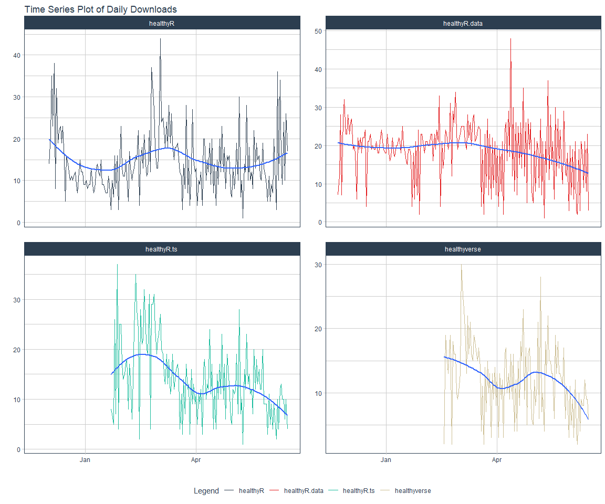

CRAN Downloads
================

This repo contains the analysis of downloads of my `R` packages:

-   [`healthyR`](https://www.spsanderson.com/healthyR/)
-   [`healthyR.data`](https://www.spsanderson.com/healthyR.data/)
-   [`healthyR.ts`](https://www.spsanderson.com/healthyR.ts/)
-   [`healthyverse`](https://www.spsanderson.com/healthyverse/)

All of which follow the [“analyses as
package”](https://rmflight.github.io/posts/2014/07/analyses_as_packages.html)
philosophy this repo itself is an `R` package that can installed using
`remotes::install_github()`.

I have forked this project itself from
[`ggcharts-analysis`](https://github.com/thomas-neitmann/ggcharts-downloads).

While I analyze `healthyverse` packages here, the functions are written
in a way that you can analyze any CRAN package with a slight
modificaiton to the `download_log` function.

This file was last updated on June 16, 2021.

# Current Trend

Here are the current 7 day trends for the `healthyverse` suite of
packages.

``` r
downloads            <- total_downloads[date >= start_date]
daily_downloads      <- compute_daily_downloads(downloads)
downloads_by_country <- compute_downloads_by_country(downloads)

p1 <- plot_daily_downloads(daily_downloads)
p2 <- plot_cumulative_downloads(daily_downloads)
p3 <- hist_daily_downloads(daily_downloads)
p4 <- plot_downloads_by_country(downloads_by_country)

f <- function(date) format(date, "%b %d, %Y")
patchwork_theme <- theme_classic(base_size = 24) +
  theme(
    plot.title = element_text(face = "bold"),
    plot.caption = element_text(size = 14)
  )
p1 + p2 + p3 + p4 +
  plot_annotation(
    title    = "healthyverse Packages - 7 Day Trend",
    subtitle = "A Summary of Downloads from the RStudio CRAN Mirror",
    caption  = glue::glue("Source: RStudio CRAN Logs ({f(start_date)} to {f(end_date)})"),
    theme    = patchwork_theme
  )
```

<!-- -->

# Since Inception

``` r
start_date <- as.Date("2020-11-15")

daily_downloads <- compute_daily_downloads(downloads = total_downloads)
downloads_by_country <- compute_downloads_by_country(downloads = total_downloads)

p1 <- plot_daily_downloads(daily_downloads)
p2 <- plot_cumulative_downloads(daily_downloads)
p3 <- hist_daily_downloads(daily_downloads)
p4 <- plot_downloads_by_country(downloads_by_country)

f <- function(date) format(date, "%b %d, %Y")
patchwork_theme <- theme_classic(base_size = 24) +
  theme(
    plot.title = element_text(face = "bold"),
    plot.caption = element_text(size = 14)
  )
p1 + p2 + p3 + p4 +
  plot_annotation(
    title    = "healthyR packages are on the Rise",
    subtitle = "A Summary of Downloads from the RStudio CRAN Mirror - Since Inception",
    caption  = glue::glue("Source: RStudio CRAN Logs ({f(start_date)} to {f(end_date)})"),
    theme    = patchwork_theme
  )
```

<!-- -->

# Some table data

``` r
top_n_downloads(total_downloads, 10, r_os) %>%
  set_names("OS", "Count") %>%
  kable()
```

| OS              | Count |
|:----------------|------:|
| NA              |  8632 |
| mingw32         |   851 |
| linux-gnu       |   482 |
| darwin15.6.0    |    29 |
| darwin13.4.0    |    23 |
| darwin17.0      |    16 |
| linux-gnueabihf |     2 |

``` r
top_n_downloads(total_downloads, 10, r_version) %>%
  set_names("Version","Count") %>%
  kable()
```

| Version | Count |
|:--------|------:|
| 3.4.4   |    76 |
| 3.4.1   |    66 |
| 3.3.3   |    26 |
| 3.4.3   |    23 |
| 3.3.2   |    11 |
| 3.2.3   |     7 |
| 3.4.2   |     7 |
| 3.2.2   |     4 |
| 3.2.1   |     2 |
| 3.4.0   |     2 |

``` r
top_n_downloads(total_downloads, 4, package) %>%
  set_names("Package","Count") %>%
  kable()
```

| Package       | Count |
|:--------------|------:|
| healthyR.data |  3789 |
| healthyR      |  2789 |
| healthyR.ts   |  2020 |
| healthyverse  |  1437 |

# Time Series Plot of each package

``` r
total_downloads %>%
  group_by(package) %>%
  summarise_by_time(
    .date_var = date
    , .by = "day"
    , count = dplyr::n()
  ) %>%
  plot_time_series(
    .date_var      = date
    , .value       = count
    , .color_var   = package
    , .facet_ncol  = 2
    , .title       = "Time Series Plot of Daily Downloads"
    , .interactive = interactive
  )
```

<!-- -->

# Cumulative Downloads by Package

``` r
p1 <- plot_cumulative_downloads_pkg(total_downloads, pkg = "healthyR")
p2 <- plot_cumulative_downloads_pkg(total_downloads, pkg = "healthyR.ts")
p3 <- plot_cumulative_downloads_pkg(total_downloads, pkg = "healthyR.data")
p4 <- plot_cumulative_downloads_pkg(total_downloads, pkg = "healthyverse")

f <- function(date) format(date, "%b %d, %Y")
patchwork_theme <- theme_classic(base_size = 24) +
  theme(
    plot.title = element_text(face = "bold"),
    plot.caption = element_text(size = 14)
  )
p1 + p2 + p3 + p4 +
  plot_annotation(
    title    = "healthyR packages are on the Rise",
    subtitle = "A Summary of Downloads from the RStudio CRAN Mirror - Since Inception",
    caption  = glue::glue("Source: RStudio CRAN Logs ({f(start_date)} to {f(end_date)})"),
    theme    = patchwork_theme
  )
```

<!-- -->
