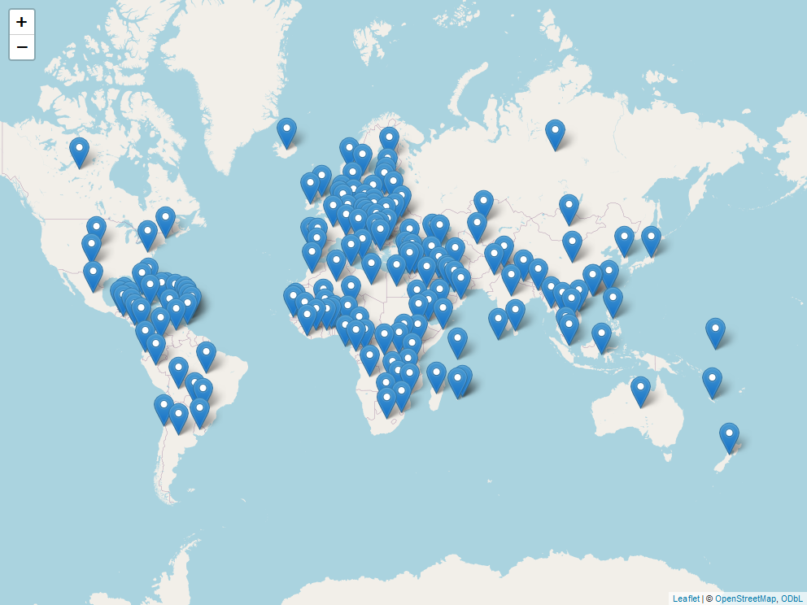

CRAN Downloads
================
Steven P. Sanderson II, MPH - Data Scientist/IT Manager
21 December, 2021

This repo contains the analysis of downloads of my `R` packages:

-   [`healthyR`](https://www.spsanderson.com/healthyR/)
-   [`healthyR.data`](https://www.spsanderson.com/healthyR.data/)
-   [`healthyR.ts`](https://www.spsanderson.com/healthyR.ts/)
-   [`healthyR.ai`](https://www.spsanderson.com/healthyR.ai/)
-   [`healthyverse`](https://www.spsanderson.com/healthyverse/)

All of which follow the [“analyses as
package”](https://rmflight.github.io/posts/2014/07/analyses_as_packages.html)
philosophy this repo itself is an `R` package that can installed using
`remotes::install_github()`.

I have forked this project itself from
[`ggcharts-analysis`](https://github.com/thomas-neitmann/ggcharts-downloads).

While I analyze `healthyverse` packages here, the functions are written
in a way that you can analyze any CRAN package with a slight
modification to the `download_log` function.

This file was last updated on December 21, 2021.

``` r
library(packagedownloads)
library(tidyverse)
library(patchwork)
library(timetk)
library(knitr)
library(leaflet)
library(htmltools)
library(tmaptools)
library(mapview)
library(countrycode)
```

``` r
start_date      <- Sys.Date() - 9 #as.Date("2020-11-15")
end_date        <- Sys.Date() - 2
total_downloads <- download_logs(start_date, end_date)
interactive     <- FALSE
pkg_release_date_tbl()
```

# Last Full Day Data

``` r
downloads            <- total_downloads %>% filter(date == max(date))
daily_downloads      <- compute_daily_downloads(downloads)
downloads_by_country <- compute_downloads_by_country(downloads)

p2 <- plot_cumulative_downloads(daily_downloads)
p4 <- plot_downloads_by_country(downloads_by_country)

f <- function(date) format(date, "%b %d, %Y")
patchwork_theme <- theme_classic(base_size = 24) +
  theme(
    plot.title   = element_text(face = "bold"),
    plot.caption = element_text(size = 14)
  )
p2 + p4 +
  plot_annotation(
    title    = "healthyverse Packages - Last Full Day",
    subtitle = "A Summary of Downloads from the RStudio CRAN Mirror",
    caption  = glue::glue("Source: RStudio CRAN Logs for {f(end_date)}"),
    theme    = patchwork_theme
  )
```

<!-- -->

``` r
downloads %>% 
  count(package, version) %>% 
  tidyr::pivot_wider(
    id_cols       = version
    , names_from  = package
    , values_from = n
    , values_fill = 0
    ) %>% 
  arrange(version) %>%
  kable()
```

| version | healthyR | healthyR.ai | healthyR.data | healthyR.ts | healthyverse |
|:--------|---------:|------------:|--------------:|------------:|-------------:|
| 0.0.4   |        0 |          21 |             0 |           0 |            0 |
| 0.1.6   |       11 |           0 |             0 |           0 |            0 |
| 0.1.7   |        0 |           0 |             0 |          25 |            0 |
| 1.0.1   |        0 |           0 |            17 |           0 |           12 |

# Current Trend

Here are the current 7 day trends for the `healthyverse` suite of
packages.

``` r
downloads            <- total_downloads[date >= start_date]
daily_downloads      <- compute_daily_downloads(downloads)
downloads_by_country <- compute_downloads_by_country(downloads)

p1 <- plot_daily_downloads(daily_downloads)
p2 <- plot_cumulative_downloads(daily_downloads)
p3 <- hist_daily_downloads(daily_downloads)
p4 <- plot_downloads_by_country(downloads_by_country)

f <- function(date) format(date, "%b %d, %Y")
patchwork_theme <- theme_classic(base_size = 24) +
  theme(
    plot.title   = element_text(face = "bold"),
    plot.caption = element_text(size = 14)
  )
p1 + p2 + p3 + p4 +
  plot_annotation(
    title    = "healthyverse Packages - 7 Day Trend",
    subtitle = "A Summary of Downloads from the RStudio CRAN Mirror",
    caption  = glue::glue("Source: RStudio CRAN Logs ({f(start_date)} to {f(end_date)})"),
    theme    = patchwork_theme
  )
```

<!-- -->

# Since Inception

``` r
start_date <- as.Date("2020-11-15")

daily_downloads <- compute_daily_downloads(downloads = total_downloads)
downloads_by_country <- compute_downloads_by_country(downloads = total_downloads)

p1 <- plot_daily_downloads(daily_downloads)
p2 <- plot_cumulative_downloads(daily_downloads)
p3 <- hist_daily_downloads(daily_downloads)
p4 <- plot_downloads_by_country(downloads_by_country)

f <- function(date) format(date, "%b %d, %Y")
patchwork_theme <- theme_classic(base_size = 24) +
  theme(
    plot.title   = element_text(face = "bold"),
    plot.caption = element_text(size = 14)
  )
p1 + p2 + p3 + p4 +
  plot_annotation(
    title    = "healthyR packages are on the Rise",
    subtitle = "A Summary of Downloads from the RStudio CRAN Mirror - Since Inception",
    caption  = glue::glue("Source: RStudio CRAN Logs ({f(start_date)} to {f(end_date)})"),
    theme    = patchwork_theme
  )
```

<!-- -->

# By Release Date

``` r
pkg_tbl <- readRDS("pkg_release_tbl.rds")
dl_tbl <- total_downloads %>%
  group_by(package) %>%
  summarise_by_time(
    .date_var = date,
    .by = "day",
    N = n()
  ) %>%
  ungroup() %>%
  select(date, package, N)

dl_tbl %>%
ggplot(aes(date, log1p(N))) +
  theme_bw() +
  geom_point(aes(group = package, color = package), size = 1) +
  ggtitle(paste("Package Downloads: {healthyverse}")) +
  geom_smooth(method = "loess", color = "black",  se = FALSE) +
  geom_vline(
    data = pkg_tbl
    , aes(xintercept = as.numeric(date))
    , color = "red"
    , lwd = 1
    , lty = "solid"
  ) +
  facet_wrap(package ~., ncol = 2, scales = "free_x") +
  theme_minimal() +
  labs(
    subtitle = "Vertical lines represent release dates",
    x = "Date",
    y = "log1p(Counts)",
    color = "Package"
  ) +
  theme(legend.position = "bottom")
```

<!-- -->

``` r
dl_tbl %>%
  select(date, N) %>%
  summarise_by_time(
    .date_var = date,
    .by = "day",
    Actual = sum(N, na.rm = TRUE)
  ) %>%
  tk_augment_differences(.value = Actual, .differences = 1) %>%
  tk_augment_differences(.value = Actual, .differences = 2) %>%
  rename(velocity = contains("_diff1")) %>%
  rename(acceleration = contains("_diff2")) %>%
  pivot_longer(-date) %>%
  mutate(name = str_to_title(name)) %>%
  mutate(name = as_factor(name)) %>%
  ggplot(aes(x = date, y = value, group = name)) +
  geom_point(alpha = .2) +
  geom_vline(
    data = pkg_tbl
    , aes(xintercept = as.numeric(date), color = package)
    , lwd = 1
    , lty = "solid"
  ) +
  facet_wrap(name ~ ., ncol = 1, scale = "free") +
  theme_minimal() +
  labs(
    title = "Total Downloads: Trend, Velocity, and Accelertion",
    subtitle = "Vertical Lines Indicate a CRAN Release date for a package.",
    x = "Date",
    y = "",
    color = ""
  ) +
  theme(legend.position = "bottom")
```

<!-- -->

# Map of Downloads

A `leaflet` map of countries where a package has been downloaded.

``` r
mapping_dataset() %>%
  head() %>%
  knitr::kable()
```

| country             |  latitude |   longitude | display\_name                                                        | icon                                                                                    |
|:--------------------|----------:|------------:|:---------------------------------------------------------------------|:----------------------------------------------------------------------------------------|
| United States       |  39.78373 | -100.445882 | United States                                                        | <https://nominatim.openstreetmap.org/ui/mapicons//poi_boundary_administrative.p.20.png> |
| United Kingdom      |  54.70235 |   -3.276575 | United Kingdom                                                       | <https://nominatim.openstreetmap.org/ui/mapicons//poi_boundary_administrative.p.20.png> |
| Germany             |  51.08342 |   10.423447 | Deutschland                                                          | <https://nominatim.openstreetmap.org/ui/mapicons//poi_boundary_administrative.p.20.png> |
| Hong Kong SAR China |  22.35063 |  114.184916 | &lt;U+9999&gt;&lt;U+6E2F&gt; Hong Kong, &lt;U+4E2D&gt;&lt;U+56FD&gt; | <https://nominatim.openstreetmap.org/ui/mapicons//poi_boundary_administrative.p.20.png> |
| Japan               |  36.57484 |  139.239418 | &lt;U+65E5&gt;&lt;U+672C&gt;                                         | <https://nominatim.openstreetmap.org/ui/mapicons//poi_boundary_administrative.p.20.png> |
| Chile               | -31.76134 |  -71.318770 | Chile                                                                | <https://nominatim.openstreetmap.org/ui/mapicons//poi_boundary_administrative.p.20.png> |

``` r
l <- map_leaflet()
mapshot(x = l, file = "map.png")
```

 To date there has been downloads in a total
of 97 different countries.

# Analysis by Package

## healthyR

``` r
start_date <- as.Date("2020-11-15")
pkg <- "healthyR"

daily_downloads <- compute_daily_downloads(
  downloads = total_downloads
  , pkg = pkg)
downloads_by_country <- compute_downloads_by_country(
  downloads = total_downloads
  , pkg = pkg)

p1 <- plot_daily_downloads(daily_downloads)
p2 <- plot_cumulative_downloads(daily_downloads)
p3 <- hist_daily_downloads(daily_downloads)
p4 <- plot_downloads_by_country(downloads_by_country)

f <- function(date) format(date, "%b %d, %Y")
patchwork_theme <- theme_classic(base_size = 24) +
  theme(
    plot.title   = element_text(face = "bold"),
    plot.caption = element_text(size = 14)
  )
p1 + p2 + p3 + p4 +
  plot_annotation(
    title    = glue::glue("Package: {pkg}"),
    subtitle = "A Summary of Downloads from the RStudio CRAN Mirror - Since Inception",
    caption  = glue::glue("Source: RStudio CRAN Logs ({f(start_date)} to {f(end_date)})"),
    theme    = patchwork_theme
  )
```

<!-- -->

## healthyR.ts

``` r
start_date <- as.Date("2020-11-15")
pkg <- "healthyR.ts"

daily_downloads <- compute_daily_downloads(
  downloads = total_downloads
  , pkg = pkg)
downloads_by_country <- compute_downloads_by_country(
  downloads = total_downloads
  , pkg = pkg)

p1 <- plot_daily_downloads(daily_downloads)
p2 <- plot_cumulative_downloads(daily_downloads)
p3 <- hist_daily_downloads(daily_downloads)
p4 <- plot_downloads_by_country(downloads_by_country)

f <- function(date) format(date, "%b %d, %Y")
patchwork_theme <- theme_classic(base_size = 24) +
  theme(
    plot.title   = element_text(face = "bold"),
    plot.caption = element_text(size = 14)
  )
p1 + p2 + p3 + p4 +
  plot_annotation(
    title    = glue::glue("Package: {pkg}"),
    subtitle = "A Summary of Downloads from the RStudio CRAN Mirror - Since Inception",
    caption  = glue::glue("Source: RStudio CRAN Logs ({f(start_date)} to {f(end_date)})"),
    theme    = patchwork_theme
  )
```

<!-- -->

## healthyR.data

``` r
start_date <- as.Date("2020-11-15")
pkg <- "healthyR.data"

daily_downloads <- compute_daily_downloads(
  downloads = total_downloads
  , pkg = pkg)
downloads_by_country <- compute_downloads_by_country(
  downloads = total_downloads
  , pkg = pkg)

p1 <- plot_daily_downloads(daily_downloads)
p2 <- plot_cumulative_downloads(daily_downloads)
p3 <- hist_daily_downloads(daily_downloads)
p4 <- plot_downloads_by_country(downloads_by_country)

f <- function(date) format(date, "%b %d, %Y")
patchwork_theme <- theme_classic(base_size = 24) +
  theme(
    plot.title   = element_text(face = "bold"),
    plot.caption = element_text(size = 14)
  )
p1 + p2 + p3 + p4 +
  plot_annotation(
    title    = glue::glue("Package: {pkg}"),
    subtitle = "A Summary of Downloads from the RStudio CRAN Mirror - Since Inception",
    caption  = glue::glue("Source: RStudio CRAN Logs ({f(start_date)} to {f(end_date)})"),
    theme    = patchwork_theme
  )
```

<!-- -->

## healthyR.ai

``` r
start_date <- as.Date("2020-11-15")
pkg <- "healthyR.ai"

daily_downloads <- compute_daily_downloads(
  downloads = total_downloads
  , pkg = pkg)
downloads_by_country <- compute_downloads_by_country(
  downloads = total_downloads
  , pkg = pkg)

p1 <- plot_daily_downloads(daily_downloads)
p2 <- plot_cumulative_downloads(daily_downloads)
p3 <- hist_daily_downloads(daily_downloads)
p4 <- plot_downloads_by_country(downloads_by_country)

f <- function(date) format(date, "%b %d, %Y")
patchwork_theme <- theme_classic(base_size = 24) +
  theme(
    plot.title   = element_text(face = "bold"),
    plot.caption = element_text(size = 14)
  )
p1 + p2 + p3 + p4 +
  plot_annotation(
    title    = glue::glue("Package: {pkg}"),
    subtitle = "A Summary of Downloads from the RStudio CRAN Mirror - Since Inception",
    caption  = glue::glue("Source: RStudio CRAN Logs ({f(start_date)} to {f(end_date)})"),
    theme    = patchwork_theme
  )
```

<!-- -->

## healthyverse

``` r
start_date <- as.Date("2020-11-15")
pkg <- "healthyverse"

daily_downloads <- compute_daily_downloads(
  downloads = total_downloads
  , pkg = pkg)
downloads_by_country <- compute_downloads_by_country(
  downloads = total_downloads
  , pkg = pkg)

p1 <- plot_daily_downloads(daily_downloads)
p2 <- plot_cumulative_downloads(daily_downloads)
p3 <- hist_daily_downloads(daily_downloads)
p4 <- plot_downloads_by_country(downloads_by_country)

f <- function(date) format(date, "%b %d, %Y")
patchwork_theme <- theme_classic(base_size = 24) +
  theme(
    plot.title   = element_text(face = "bold"),
    plot.caption = element_text(size = 14)
  )
p1 + p2 + p3 + p4 +
  plot_annotation(
    title    = glue::glue("Package: {pkg}"),
    subtitle = "A Summary of Downloads from the RStudio CRAN Mirror - Since Inception",
    caption  = glue::glue("Source: RStudio CRAN Logs ({f(start_date)} to {f(end_date)})"),
    theme    = patchwork_theme
  )
```

<!-- -->

# Table Data

### Downloads by Package and Version

``` r
total_downloads %>% 
  count(package, version) %>% 
  tidyr::pivot_wider(
    id_cols       = version
    , names_from  = package
    , values_from = n
    , values_fill = 0
    ) %>%
  arrange(version) %>%
  kable()
```

| version | healthyR | healthyR.ai | healthyR.data | healthyR.ts | healthyverse |
|:--------|---------:|------------:|--------------:|------------:|-------------:|
| 0.0.1   |        0 |         267 |             0 |           0 |            0 |
| 0.0.2   |        0 |        1515 |             0 |           0 |            0 |
| 0.0.3   |        0 |         275 |             0 |           0 |            0 |
| 0.0.4   |        0 |         209 |             0 |           0 |            0 |
| 0.1.0   |      158 |           0 |             0 |         382 |            0 |
| 0.1.1   |     1205 |           0 |             0 |        1863 |            0 |
| 0.1.2   |     1384 |           0 |             0 |         903 |            0 |
| 0.1.3   |      228 |           0 |             0 |        1023 |            0 |
| 0.1.4   |      276 |           0 |             0 |         582 |            0 |
| 0.1.5   |      927 |           0 |             0 |         418 |            0 |
| 0.1.6   |     1976 |           0 |             0 |         159 |            0 |
| 0.1.7   |        0 |           0 |             0 |         190 |            0 |
| 1.0.0   |        0 |           0 |          2780 |           0 |         2195 |
| 1.0.1   |        0 |           0 |          4713 |           0 |         1841 |

# Cumulative Downloads by Package

``` r
p1 <- plot_cumulative_downloads_pkg(total_downloads, pkg = "healthyR")
p2 <- plot_cumulative_downloads_pkg(total_downloads, pkg = "healthyR.ts")
p3 <- plot_cumulative_downloads_pkg(total_downloads, pkg = "healthyR.data")
p4 <- plot_cumulative_downloads_pkg(total_downloads, pkg = "healthyverse")
p5 <- plot_cumulative_downloads_pkg(total_downloads, pkg = "healthyR.ai")

f <- function(date) format(date, "%b %d, %Y")
patchwork_theme <- theme_classic(base_size = 24) +
  theme(
    plot.title   = element_text(face = "bold"),
    plot.caption = element_text(size = 14)
  )
p1 + p2 + p3 + p4 + p5 +
  plot_annotation(
    title    = "healthyR packages are on the Rise",
    subtitle = "A Summary of Downloads from the RStudio CRAN Mirror - Since Inception",
    caption  = glue::glue("Source: RStudio CRAN Logs ({f(start_date)} to {f(end_date)})"),
    theme    = patchwork_theme
  )
```

<!-- -->
