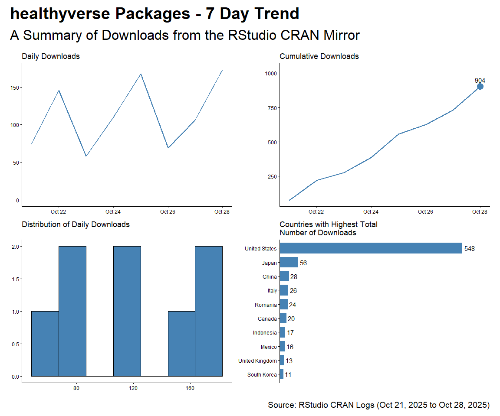

CRAN Downloads
================
Steven P. Sanderson II, MPH - Data Scientist/IT Manager
16 September, 2021

This repo contains the analysis of downloads of my `R` packages:

-   [`healthyR`](https://www.spsanderson.com/healthyR/)
-   [`healthyR.data`](https://www.spsanderson.com/healthyR.data/)
-   [`healthyR.ts`](https://www.spsanderson.com/healthyR.ts/)
-   [`healthyR.ai`](https://www.spsanderson.com/healthyR.ai/)
-   [`healthyverse`](https://www.spsanderson.com/healthyverse/)

All of which follow the [“analyses as
package”](https://rmflight.github.io/posts/2014/07/analyses_as_packages.html)
philosophy this repo itself is an `R` package that can installed using
`remotes::install_github()`.

I have forked this project itself from
[`ggcharts-analysis`](https://github.com/thomas-neitmann/ggcharts-downloads).

While I analyze `healthyverse` packages here, the functions are written
in a way that you can analyze any CRAN package with a slight
modification to the `download_log` function.

This file was last updated on September 16, 2021.

``` r
library(packagedownloads)
library(ggplot2)
library(patchwork)
library(dplyr)
library(timetk)
library(purrr)
library(knitr)
```

``` r
start_date      <- Sys.Date() - 9
end_date        <- Sys.Date() - 2
total_downloads <- download_logs(start_date, end_date)
interactive     <- FALSE
```

# Last Full Day Data

``` r
downloads            <- total_downloads %>% filter(date == max(date))
daily_downloads      <- compute_daily_downloads(downloads)
downloads_by_country <- compute_downloads_by_country(downloads)

p2 <- plot_cumulative_downloads(daily_downloads)
p4 <- plot_downloads_by_country(downloads_by_country)

f <- function(date) format(date, "%b %d, %Y")
patchwork_theme <- theme_classic(base_size = 24) +
  theme(
    plot.title = element_text(face = "bold"),
    plot.caption = element_text(size = 14)
  )
p2 + p4 +
  plot_annotation(
    title    = "healthyverse Packages - Last Full Day",
    subtitle = "A Summary of Downloads from the RStudio CRAN Mirror",
    caption  = glue::glue("Source: RStudio CRAN Logs for {f(end_date)}"),
    theme    = patchwork_theme
  )
```

<!-- -->

``` r
downloads %>% 
  count(package, version) %>% 
  tidyr::pivot_wider(
    id_cols       = version
    , names_from  = package
    , values_from = n
    , values_fill = 0
    ) %>% 
  arrange(version) %>%
  kable()
```

| version | healthyR | healthyR.ai | healthyR.data | healthyR.ts | healthyverse |
|:--------|---------:|------------:|--------------:|------------:|-------------:|
| 0.0.2   |        0 |          22 |             0 |           0 |            0 |
| 0.1.3   |        0 |           0 |             0 |          12 |            0 |
| 0.1.6   |       10 |           0 |             0 |           0 |            0 |
| 1.0.1   |        0 |           0 |            17 |           0 |           11 |

# Current Trend

Here are the current 7 day trends for the `healthyverse` suite of
packages.

``` r
downloads            <- total_downloads[date >= start_date]
daily_downloads      <- compute_daily_downloads(downloads)
downloads_by_country <- compute_downloads_by_country(downloads)

p1 <- plot_daily_downloads(daily_downloads)
p2 <- plot_cumulative_downloads(daily_downloads)
p3 <- hist_daily_downloads(daily_downloads)
p4 <- plot_downloads_by_country(downloads_by_country)

f <- function(date) format(date, "%b %d, %Y")
patchwork_theme <- theme_classic(base_size = 24) +
  theme(
    plot.title = element_text(face = "bold"),
    plot.caption = element_text(size = 14)
  )
p1 + p2 + p3 + p4 +
  plot_annotation(
    title    = "healthyverse Packages - 7 Day Trend",
    subtitle = "A Summary of Downloads from the RStudio CRAN Mirror",
    caption  = glue::glue("Source: RStudio CRAN Logs ({f(start_date)} to {f(end_date)})"),
    theme    = patchwork_theme
  )
```

<!-- -->

# Since Inception

``` r
start_date <- as.Date("2020-11-15")

daily_downloads <- compute_daily_downloads(downloads = total_downloads)
downloads_by_country <- compute_downloads_by_country(downloads = total_downloads)

p1 <- plot_daily_downloads(daily_downloads)
p2 <- plot_cumulative_downloads(daily_downloads)
p3 <- hist_daily_downloads(daily_downloads)
p4 <- plot_downloads_by_country(downloads_by_country)

f <- function(date) format(date, "%b %d, %Y")
patchwork_theme <- theme_classic(base_size = 24) +
  theme(
    plot.title = element_text(face = "bold"),
    plot.caption = element_text(size = 14)
  )
p1 + p2 + p3 + p4 +
  plot_annotation(
    title    = "healthyR packages are on the Rise",
    subtitle = "A Summary of Downloads from the RStudio CRAN Mirror - Since Inception",
    caption  = glue::glue("Source: RStudio CRAN Logs ({f(start_date)} to {f(end_date)})"),
    theme    = patchwork_theme
  )
```

<!-- -->

# Analysis by Package

## healthyR

``` r
start_date <- as.Date("2020-11-15")
pkg <- "healthyR"

daily_downloads <- compute_daily_downloads(
  downloads = total_downloads
  , pkg = pkg)
downloads_by_country <- compute_downloads_by_country(
  downloads = total_downloads
  , pkg = pkg)

p1 <- plot_daily_downloads(daily_downloads)
p2 <- plot_cumulative_downloads(daily_downloads)
p3 <- hist_daily_downloads(daily_downloads)
p4 <- plot_downloads_by_country(downloads_by_country)

f <- function(date) format(date, "%b %d, %Y")
patchwork_theme <- theme_classic(base_size = 24) +
  theme(
    plot.title = element_text(face = "bold"),
    plot.caption = element_text(size = 14)
  )
p1 + p2 + p3 + p4 +
  plot_annotation(
    title    = glue::glue("Package: {pkg}"),
    subtitle = "A Summary of Downloads from the RStudio CRAN Mirror - Since Inception",
    caption  = glue::glue("Source: RStudio CRAN Logs ({f(start_date)} to {f(end_date)})"),
    theme    = patchwork_theme
  )
```

<!-- -->

## healthyR.ts

``` r
start_date <- as.Date("2020-11-15")
pkg <- "healthyR.ts"

daily_downloads <- compute_daily_downloads(
  downloads = total_downloads
  , pkg = pkg)
downloads_by_country <- compute_downloads_by_country(
  downloads = total_downloads
  , pkg = pkg)

p1 <- plot_daily_downloads(daily_downloads)
p2 <- plot_cumulative_downloads(daily_downloads)
p3 <- hist_daily_downloads(daily_downloads)
p4 <- plot_downloads_by_country(downloads_by_country)

f <- function(date) format(date, "%b %d, %Y")
patchwork_theme <- theme_classic(base_size = 24) +
  theme(
    plot.title = element_text(face = "bold"),
    plot.caption = element_text(size = 14)
  )
p1 + p2 + p3 + p4 +
  plot_annotation(
    title    = glue::glue("Package: {pkg}"),
    subtitle = "A Summary of Downloads from the RStudio CRAN Mirror - Since Inception",
    caption  = glue::glue("Source: RStudio CRAN Logs ({f(start_date)} to {f(end_date)})"),
    theme    = patchwork_theme
  )
```

<!-- -->

## healthyR.data

``` r
start_date <- as.Date("2020-11-15")
pkg <- "healthyR.data"

daily_downloads <- compute_daily_downloads(
  downloads = total_downloads
  , pkg = pkg)
downloads_by_country <- compute_downloads_by_country(
  downloads = total_downloads
  , pkg = pkg)

p1 <- plot_daily_downloads(daily_downloads)
p2 <- plot_cumulative_downloads(daily_downloads)
p3 <- hist_daily_downloads(daily_downloads)
p4 <- plot_downloads_by_country(downloads_by_country)

f <- function(date) format(date, "%b %d, %Y")
patchwork_theme <- theme_classic(base_size = 24) +
  theme(
    plot.title = element_text(face = "bold"),
    plot.caption = element_text(size = 14)
  )
p1 + p2 + p3 + p4 +
  plot_annotation(
    title    = glue::glue("Package: {pkg}"),
    subtitle = "A Summary of Downloads from the RStudio CRAN Mirror - Since Inception",
    caption  = glue::glue("Source: RStudio CRAN Logs ({f(start_date)} to {f(end_date)})"),
    theme    = patchwork_theme
  )
```

<!-- -->

## healthyR.ai

``` r
start_date <- as.Date("2020-11-15")
pkg <- "healthyR.ai"

daily_downloads <- compute_daily_downloads(
  downloads = total_downloads
  , pkg = pkg)
downloads_by_country <- compute_downloads_by_country(
  downloads = total_downloads
  , pkg = pkg)

p1 <- plot_daily_downloads(daily_downloads)
p2 <- plot_cumulative_downloads(daily_downloads)
p3 <- hist_daily_downloads(daily_downloads)
p4 <- plot_downloads_by_country(downloads_by_country)

f <- function(date) format(date, "%b %d, %Y")
patchwork_theme <- theme_classic(base_size = 24) +
  theme(
    plot.title = element_text(face = "bold"),
    plot.caption = element_text(size = 14)
  )
p1 + p2 + p3 + p4 +
  plot_annotation(
    title    = glue::glue("Package: {pkg}"),
    subtitle = "A Summary of Downloads from the RStudio CRAN Mirror - Since Inception",
    caption  = glue::glue("Source: RStudio CRAN Logs ({f(start_date)} to {f(end_date)})"),
    theme    = patchwork_theme
  )
```

<!-- -->

## healthyverse

``` r
start_date <- as.Date("2020-11-15")
pkg <- "healthyverse"

daily_downloads <- compute_daily_downloads(
  downloads = total_downloads
  , pkg = pkg)
downloads_by_country <- compute_downloads_by_country(
  downloads = total_downloads
  , pkg = pkg)

p1 <- plot_daily_downloads(daily_downloads)
p2 <- plot_cumulative_downloads(daily_downloads)
p3 <- hist_daily_downloads(daily_downloads)
p4 <- plot_downloads_by_country(downloads_by_country)

f <- function(date) format(date, "%b %d, %Y")
patchwork_theme <- theme_classic(base_size = 24) +
  theme(
    plot.title = element_text(face = "bold"),
    plot.caption = element_text(size = 14)
  )
p1 + p2 + p3 + p4 +
  plot_annotation(
    title    = glue::glue("Package: {pkg}"),
    subtitle = "A Summary of Downloads from the RStudio CRAN Mirror - Since Inception",
    caption  = glue::glue("Source: RStudio CRAN Logs ({f(start_date)} to {f(end_date)})"),
    theme    = patchwork_theme
  )
```

<!-- -->

# Some table data

``` r
top_n_downloads(total_downloads, 4, r_os) %>%
  set_names("OS", "Count") %>%
  kable()
```

| OS           | Count |
|:-------------|------:|
| darwin17.0   |   131 |
| darwin15.6.0 |    34 |
| darwin13.4.0 |    23 |
| darwin20     |     4 |

``` r
top_n_downloads(total_downloads, 4, r_version) %>%
  set_names("Version","Count") %>%
  kable()
```

| Version | Count |
|:--------|------:|
| 3.2.3   |    14 |
| 3.2.2   |     4 |
| 3.2.5   |     4 |
| 3.2.1   |     2 |

``` r
total_downloads %>% 
  count(package, version) %>% 
  tidyr::pivot_wider(
    id_cols       = version
    , names_from  = package
    , values_from = n
    , values_fill = 0
    ) %>%
  arrange(version) %>%
  kable()
```

| version | healthyR | healthyR.ai | healthyR.data | healthyR.ts | healthyverse |
|:--------|---------:|------------:|--------------:|------------:|-------------:|
| 0.0.1   |        0 |         242 |             0 |           0 |            0 |
| 0.0.2   |        0 |         174 |             0 |           0 |            0 |
| 0.1.0   |      138 |           0 |             0 |         359 |            0 |
| 0.1.1   |     1185 |           0 |             0 |        1836 |            0 |
| 0.1.2   |     1357 |           0 |             0 |         880 |            0 |
| 0.1.3   |      205 |           0 |             0 |         325 |            0 |
| 0.1.4   |      253 |           0 |             0 |           0 |            0 |
| 0.1.5   |      904 |           0 |             0 |           0 |            0 |
| 0.1.6   |      356 |           0 |             0 |           0 |            0 |
| 1.0.0   |        0 |           0 |          2759 |           0 |         2168 |
| 1.0.1   |        0 |           0 |          2589 |           0 |          304 |

# Cumulative Downloads by Package

``` r
p1 <- plot_cumulative_downloads_pkg(total_downloads, pkg = "healthyR")
p2 <- plot_cumulative_downloads_pkg(total_downloads, pkg = "healthyR.ts")
p3 <- plot_cumulative_downloads_pkg(total_downloads, pkg = "healthyR.data")
p4 <- plot_cumulative_downloads_pkg(total_downloads, pkg = "healthyverse")
p5 <- plot_cumulative_downloads_pkg(total_downloads, pkg = "healthyR.ai")

f <- function(date) format(date, "%b %d, %Y")
patchwork_theme <- theme_classic(base_size = 24) +
  theme(
    plot.title = element_text(face = "bold"),
    plot.caption = element_text(size = 14)
  )
p1 + p2 + p3 + p4 + p5 +
  plot_annotation(
    title    = "healthyR packages are on the Rise",
    subtitle = "A Summary of Downloads from the RStudio CRAN Mirror - Since Inception",
    caption  = glue::glue("Source: RStudio CRAN Logs ({f(start_date)} to {f(end_date)})"),
    theme    = patchwork_theme
  )
```

<!-- -->
