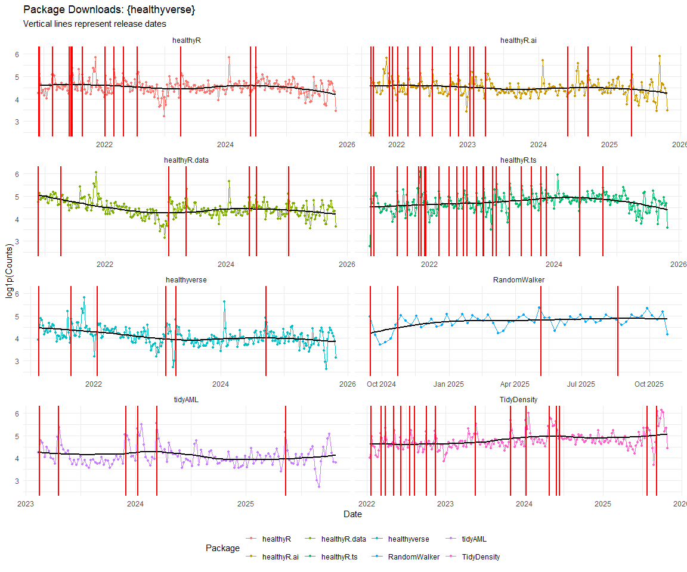
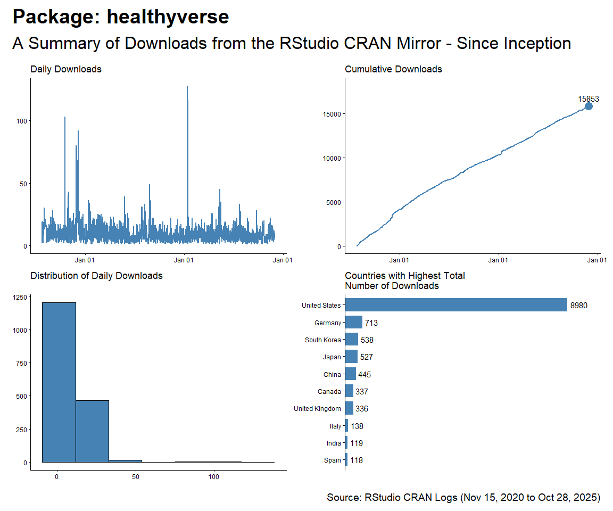
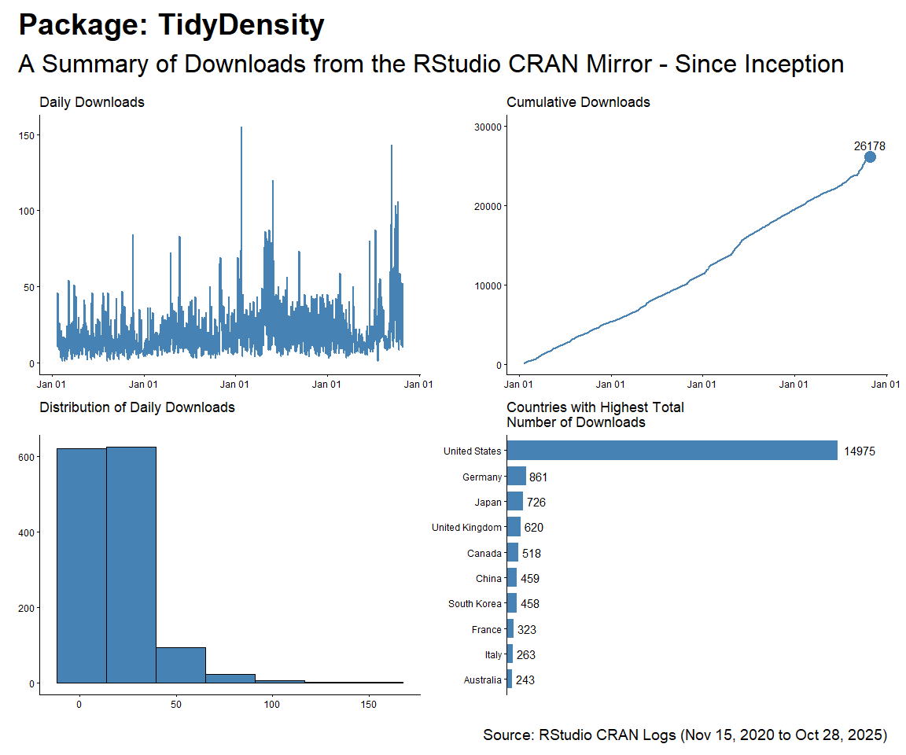
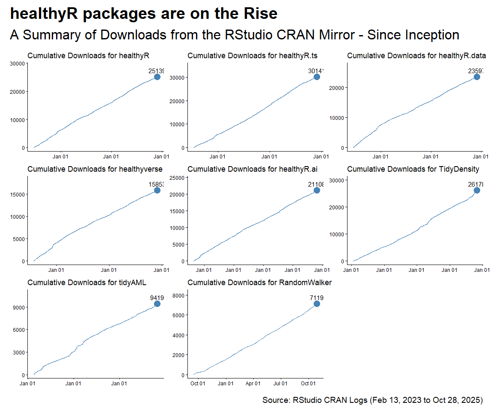
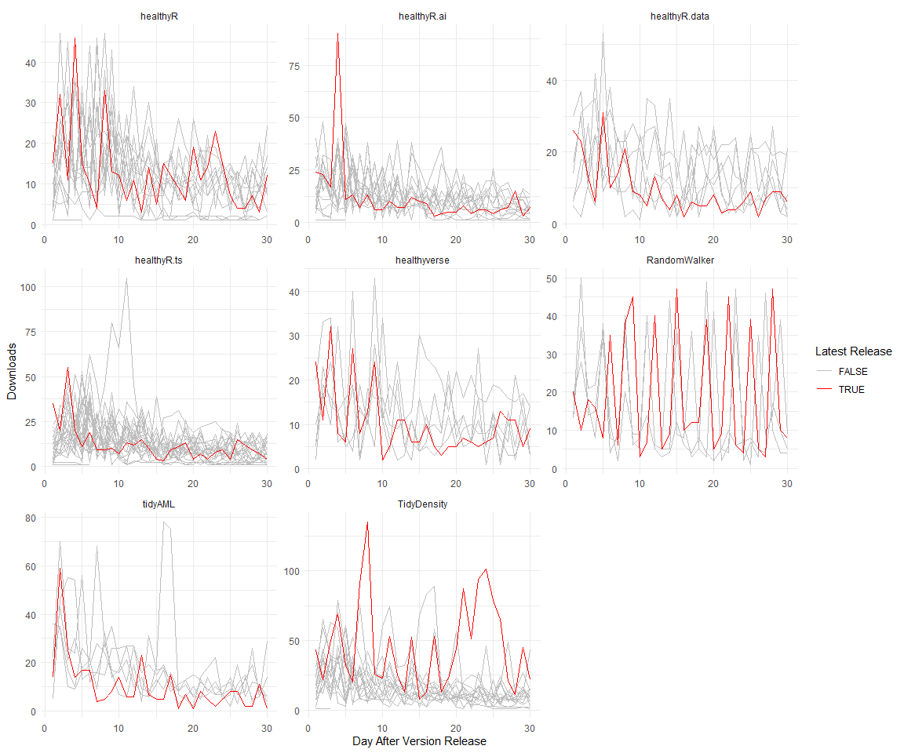
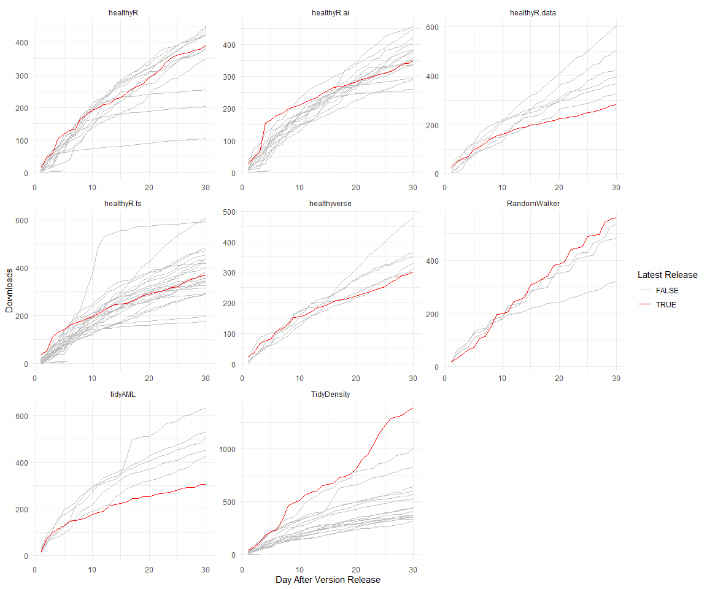

CRAN Downloads
================
Steven P. Sanderson II, MPH - Date:
13 May, 2024

This repo contains the analysis of downloads of my `R` packages:

- [`healthyR`](https://www.spsanderson.com/healthyR/)
- [`healthyR.data`](https://www.spsanderson.com/healthyR.data/)
- [`healthyR.ts`](https://www.spsanderson.com/healthyR.ts/)
- [`healthyR.ai`](https://www.spsanderson.com/healthyR.ai/)
- [`healthyverse`](https://www.spsanderson.com/healthyverse/)
- [`TidyDensity`](https://www.spsanderson.com/TidyDensity/)
- [`tidyAML`](https://www.spsanderson.com/tidyAML/)

All of which follow the [“analyses as
package”](https://rmflight.github.io/posts/2014/07/analyses_as_packages.html)
philosophy this repo itself is an `R` package that can installed using
`remotes::install_github()`.

I have forked this project itself from
[`ggcharts-analysis`](https://github.com/thomas-neitmann/ggcharts-downloads).

While I analyze `healthyverse` packages here, the functions are written
in a way that you can analyze any CRAN package with a slight
modification to the `download_log` function.

This file was last updated on May 13, 2024.

``` r
library(packagedownloads)
library(tidyverse)
library(patchwork)
library(timetk)
library(knitr)
library(leaflet)
library(htmltools)
library(tmaptools)
library(mapview)
library(countrycode)
library(htmlwidgets)
library(webshot)
library(rmarkdown)
library(dtplyr)
```

``` r
start_date      <- Sys.Date() - 9 #as.Date("2020-11-15")
end_date        <- Sys.Date() - 2
total_downloads <- download_logs(start_date, end_date)
interactive     <- FALSE
pkg_release_date_tbl()
```

# Last Full Day Data

``` r
downloads            <- total_downloads |> filter(date == max(date))
daily_downloads      <- compute_daily_downloads(downloads)
downloads_by_country <- compute_downloads_by_country(downloads)

p1 <- plot_cumulative_downloads(daily_downloads)
p2 <- plot_downloads_by_country(downloads_by_country)

f <- function(date) format(date, "%b %d, %Y")
patchwork_theme <- theme_classic(base_size = 24) +
  theme(
    plot.title   = element_text(face = "bold"),
    plot.caption = element_text(size = 14)
  )
p1 + p2 +
  plot_annotation(
    title    = "healthyverse Packages - Last Full Day",
    subtitle = "A Summary of Downloads from the RStudio CRAN Mirror",
    caption  = glue::glue("Source: RStudio CRAN Logs for {f(end_date)}"),
    theme    = patchwork_theme
  )
```

<!-- -->

``` r
downloads |>
  count(package, version) |> 
  tidyr::pivot_wider(
    id_cols       = version
    , names_from  = package
    , values_from = n
    , values_fill = 0
    ) |>
  arrange(version) |>
  kable()
```

| version | TidyDensity | healthyR | healthyR.ai | healthyR.data | healthyR.ts | healthyverse | tidyAML |
|:--------|------------:|---------:|------------:|--------------:|------------:|-------------:|--------:|
| 0.0.13  |           0 |        0 |           3 |             0 |           0 |            0 |       0 |
| 0.0.5   |           0 |        0 |           0 |             0 |           0 |            0 |       4 |
| 0.1.0   |           0 |        1 |           0 |             0 |           0 |            0 |       0 |
| 0.2.0   |           0 |        0 |           0 |             0 |           1 |            0 |       0 |
| 0.2.1   |           0 |       15 |           0 |             0 |           0 |            0 |       0 |
| 0.3.0   |           0 |        0 |           0 |             0 |           3 |            0 |       0 |
| 1.0.3   |           0 |        0 |           0 |             3 |           0 |            0 |       0 |
| 1.0.4   |           0 |        0 |           0 |             0 |           0 |            3 |       0 |
| 1.4.0   |           8 |        0 |           0 |             0 |           0 |            0 |       0 |

``` r
downloads |>
  count(package) |>
  tidyr::pivot_wider(
    names_from = package,
    values_from = n,
    values_fill = 0
  ) |>
  kable()
```

| TidyDensity | healthyR | healthyR.ai | healthyR.data | healthyR.ts | healthyverse | tidyAML |
|------------:|---------:|------------:|--------------:|------------:|-------------:|--------:|
|           8 |       16 |           3 |             3 |           4 |            3 |       4 |

# Current Trend

Here are the current 7 day trends for the `healthyverse` suite of
packages.

``` r
downloads            <- total_downloads[date >= start_date]
daily_downloads      <- compute_daily_downloads(downloads)
downloads_by_country <- compute_downloads_by_country(downloads)

p1 <- plot_daily_downloads(daily_downloads)
p2 <- plot_cumulative_downloads(daily_downloads)
p3 <- hist_daily_downloads(daily_downloads)
p4 <- plot_downloads_by_country(downloads_by_country)

f <- function(date) format(date, "%b %d, %Y")
patchwork_theme <- theme_classic(base_size = 24) +
  theme(
    plot.title   = element_text(face = "bold"),
    plot.caption = element_text(size = 14)
  )
p1 + p2 + p3 + p4 +
  plot_annotation(
    title    = "healthyverse Packages - 7 Day Trend",
    subtitle = "A Summary of Downloads from the RStudio CRAN Mirror",
    caption  = glue::glue("Source: RStudio CRAN Logs ({f(start_date)} to {f(end_date)})"),
    theme    = patchwork_theme
  )
```

<!-- -->

# Since Inception

``` r
start_date <- as.Date("2020-11-15")

daily_downloads <- compute_daily_downloads(downloads = total_downloads)
downloads_by_country <- compute_downloads_by_country(downloads = total_downloads)

p1 <- plot_daily_downloads(daily_downloads)
p2 <- plot_cumulative_downloads(daily_downloads)
p3 <- hist_daily_downloads(daily_downloads)
p4 <- plot_downloads_by_country(downloads_by_country)

f <- function(date) format(date, "%b %d, %Y")
patchwork_theme <- theme_classic(base_size = 24) +
  theme(
    plot.title   = element_text(face = "bold"),
    plot.caption = element_text(size = 14)
  )
p1 + p2 + p3 + p4 +
  plot_annotation(
    title    = "healthyR packages are on the Rise",
    subtitle = "A Summary of Downloads from the RStudio CRAN Mirror - Since Inception",
    caption  = glue::glue("Source: RStudio CRAN Logs ({f(start_date)} to {f(end_date)})"),
    theme    = patchwork_theme
  )
```

<!-- -->

# By Release Date

``` r
pkg_tbl <- readRDS("pkg_release_tbl.rds")
dl_tbl <- total_downloads %>%
  group_by(package) %>%
  summarise_by_time(
    .date_var = date,
    .by = "week",
    N = n()
  ) %>%
  ungroup() %>%
  select(date, package, N)

dl_tbl %>%
ggplot(aes(date, log1p(N))) +
  theme_bw() +
  geom_point(aes(group = package, color = package), size = 1) +
  geom_line(aes(group = package, color = package)) +
  ggtitle(paste("Package Downloads: {healthyverse}")) +
  geom_smooth(method = "loess", color = "black",  se = FALSE) +
  geom_vline(
    data = pkg_tbl
    , aes(xintercept = as.numeric(date))
    , color = "red"
    , lwd = 1
    , lty = "solid"
  ) +
  facet_wrap(package ~., ncol = 2, scales = "free_x") +
  theme_minimal() +
  labs(
    subtitle = "Vertical lines represent release dates",
    x = "Date",
    y = "log1p(Counts)",
    color = "Package"
  ) +
  theme(legend.position = "bottom")
```

<!-- -->

``` r
dl_tbl %>%
  select(date, N) %>%
  summarise_by_time(
    .date_var = date,
    .by = "week",
    Actual = sum(N, na.rm = TRUE)
  ) %>%
  tk_augment_differences(.value = Actual, .differences = 1) %>%
  tk_augment_differences(.value = Actual, .differences = 2) %>%
  rename(velocity = contains("_diff1")) %>%
  rename(acceleration = contains("_diff2")) %>%
  pivot_longer(-date) %>%
  mutate(name = str_to_title(name)) %>%
  mutate(name = as_factor(name)) %>%
  ggplot(aes(x = date, y = log1p(value), group = name)) +
  geom_point(alpha = .2) +
  geom_vline(
    data = pkg_tbl
    , aes(xintercept = as.numeric(date), color = package)
    , lwd = 1
    , lty = "solid"
  ) +
  facet_wrap(name ~ ., ncol = 1, scale = "free") +
  theme_minimal() +
  labs(
    title = "Total Downloads: Trend, Velocity, and Accelertion",
    subtitle = "Vertical Lines Indicate a CRAN Release date for a package.",
    x = "Date",
    y = "",
    color = ""
  ) +
  theme(legend.position = "bottom")
```

<!-- -->

# Map of Downloads

A `leaflet` map of countries where a package has been downloaded.

``` r
mapping_dataset() %>%
  head() %>%
  knitr::kable()

l <- map_leaflet()
saveWidget(l, "downloads_map.html")
webshot("downloads_map.html", file = "map.png",
        cliprect = "viewport")
```

To date there has been downloads in a total of 151 different countries.

# Analysis by Package

## healthyR

``` r
start_date <- as.Date("2020-11-15")
pkg <- "healthyR"

daily_downloads <- compute_daily_downloads(
  downloads = total_downloads
  , pkg = pkg)
downloads_by_country <- compute_downloads_by_country(
  downloads = total_downloads
  , pkg = pkg)

p1 <- plot_daily_downloads(daily_downloads)
p2 <- plot_cumulative_downloads(daily_downloads)
p3 <- hist_daily_downloads(daily_downloads)
p4 <- plot_downloads_by_country(downloads_by_country)

f <- function(date) format(date, "%b %d, %Y")
patchwork_theme <- theme_classic(base_size = 24) +
  theme(
    plot.title   = element_text(face = "bold"),
    plot.caption = element_text(size = 14)
  )
p1 + p2 + p3 + p4 +
  plot_annotation(
    title    = glue::glue("Package: {pkg}"),
    subtitle = "A Summary of Downloads from the RStudio CRAN Mirror - Since Inception",
    caption  = glue::glue("Source: RStudio CRAN Logs ({f(start_date)} to {f(end_date)})"),
    theme    = patchwork_theme
  )
```

<!-- -->

## healthyR.ts

``` r
start_date <- as.Date("2020-11-15")
pkg <- "healthyR.ts"

daily_downloads <- compute_daily_downloads(
  downloads = total_downloads
  , pkg = pkg)
downloads_by_country <- compute_downloads_by_country(
  downloads = total_downloads
  , pkg = pkg)

p1 <- plot_daily_downloads(daily_downloads)
p2 <- plot_cumulative_downloads(daily_downloads)
p3 <- hist_daily_downloads(daily_downloads)
p4 <- plot_downloads_by_country(downloads_by_country)

f <- function(date) format(date, "%b %d, %Y")
patchwork_theme <- theme_classic(base_size = 24) +
  theme(
    plot.title   = element_text(face = "bold"),
    plot.caption = element_text(size = 14)
  )
p1 + p2 + p3 + p4 +
  plot_annotation(
    title    = glue::glue("Package: {pkg}"),
    subtitle = "A Summary of Downloads from the RStudio CRAN Mirror - Since Inception",
    caption  = glue::glue("Source: RStudio CRAN Logs ({f(start_date)} to {f(end_date)})"),
    theme    = patchwork_theme
  )
```

<!-- -->

## healthyR.data

``` r
start_date <- as.Date("2020-11-15")
pkg <- "healthyR.data"

daily_downloads <- compute_daily_downloads(
  downloads = total_downloads
  , pkg = pkg)
downloads_by_country <- compute_downloads_by_country(
  downloads = total_downloads
  , pkg = pkg)

p1 <- plot_daily_downloads(daily_downloads)
p2 <- plot_cumulative_downloads(daily_downloads)
p3 <- hist_daily_downloads(daily_downloads)
p4 <- plot_downloads_by_country(downloads_by_country)

f <- function(date) format(date, "%b %d, %Y")
patchwork_theme <- theme_classic(base_size = 24) +
  theme(
    plot.title   = element_text(face = "bold"),
    plot.caption = element_text(size = 14)
  )
p1 + p2 + p3 + p4 +
  plot_annotation(
    title    = glue::glue("Package: {pkg}"),
    subtitle = "A Summary of Downloads from the RStudio CRAN Mirror - Since Inception",
    caption  = glue::glue("Source: RStudio CRAN Logs ({f(start_date)} to {f(end_date)})"),
    theme    = patchwork_theme
  )
```

<!-- -->

## healthyR.ai

``` r
start_date <- as.Date("2020-11-15")
pkg <- "healthyR.ai"

daily_downloads <- compute_daily_downloads(
  downloads = total_downloads
  , pkg = pkg)
downloads_by_country <- compute_downloads_by_country(
  downloads = total_downloads
  , pkg = pkg)

p1 <- plot_daily_downloads(daily_downloads)
p2 <- plot_cumulative_downloads(daily_downloads)
p3 <- hist_daily_downloads(daily_downloads)
p4 <- plot_downloads_by_country(downloads_by_country)

f <- function(date) format(date, "%b %d, %Y")
patchwork_theme <- theme_classic(base_size = 24) +
  theme(
    plot.title   = element_text(face = "bold"),
    plot.caption = element_text(size = 14)
  )
p1 + p2 + p3 + p4 +
  plot_annotation(
    title    = glue::glue("Package: {pkg}"),
    subtitle = "A Summary of Downloads from the RStudio CRAN Mirror - Since Inception",
    caption  = glue::glue("Source: RStudio CRAN Logs ({f(start_date)} to {f(end_date)})"),
    theme    = patchwork_theme
  )
```

<!-- -->

## healthyverse

``` r
start_date <- as.Date("2020-11-15")
pkg <- "healthyverse"

daily_downloads <- compute_daily_downloads(
  downloads = total_downloads
  , pkg = pkg)
downloads_by_country <- compute_downloads_by_country(
  downloads = total_downloads
  , pkg = pkg)

p1 <- plot_daily_downloads(daily_downloads)
p2 <- plot_cumulative_downloads(daily_downloads)
p3 <- hist_daily_downloads(daily_downloads)
p4 <- plot_downloads_by_country(downloads_by_country)

f <- function(date) format(date, "%b %d, %Y")
patchwork_theme <- theme_classic(base_size = 24) +
  theme(
    plot.title   = element_text(face = "bold"),
    plot.caption = element_text(size = 14)
  )
p1 + p2 + p3 + p4 +
  plot_annotation(
    title    = glue::glue("Package: {pkg}"),
    subtitle = "A Summary of Downloads from the RStudio CRAN Mirror - Since Inception",
    caption  = glue::glue("Source: RStudio CRAN Logs ({f(start_date)} to {f(end_date)})"),
    theme    = patchwork_theme
  )
```

<!-- -->

## TidyDensity

``` r
start_date <- as.Date("2020-11-15")
pkg <- "TidyDensity"

daily_downloads <- compute_daily_downloads(
  downloads = total_downloads
  , pkg = pkg)
downloads_by_country <- compute_downloads_by_country(
  downloads = total_downloads
  , pkg = pkg)

p1 <- plot_daily_downloads(daily_downloads)
p2 <- plot_cumulative_downloads(daily_downloads)
p3 <- hist_daily_downloads(daily_downloads)
p4 <- plot_downloads_by_country(downloads_by_country)

f <- function(date) format(date, "%b %d, %Y")
patchwork_theme <- theme_classic(base_size = 24) +
  theme(
    plot.title   = element_text(face = "bold"),
    plot.caption = element_text(size = 14)
  )
p1 + p2 + p3 + p4 +
  plot_annotation(
    title    = glue::glue("Package: {pkg}"),
    subtitle = "A Summary of Downloads from the RStudio CRAN Mirror - Since Inception",
    caption  = glue::glue("Source: RStudio CRAN Logs ({f(start_date)} to {f(end_date)})"),
    theme    = patchwork_theme
  )
```

<!-- -->

## tidyAML

``` r
start_date <- as.Date("2023-02-13")
pkg <- "tidyAML"

daily_downloads <- compute_daily_downloads(
  downloads = total_downloads
  , pkg = pkg)
downloads_by_country <- compute_downloads_by_country(
  downloads = total_downloads
  , pkg = pkg)

p1 <- plot_daily_downloads(daily_downloads)
p2 <- plot_cumulative_downloads(daily_downloads)
p3 <- hist_daily_downloads(daily_downloads)
p4 <- plot_downloads_by_country(downloads_by_country)

f <- function(date) format(date, "%b %d, %Y")
patchwork_theme <- theme_classic(base_size = 24) +
  theme(
    plot.title   = element_text(face = "bold"),
    plot.caption = element_text(size = 14)
  )
p1 + p2 + p3 + p4 +
  plot_annotation(
    title    = glue::glue("Package: {pkg}"),
    subtitle = "A Summary of Downloads from the RStudio CRAN Mirror - Since Inception",
    caption  = glue::glue("Source: RStudio CRAN Logs ({f(start_date)} to {f(end_date)})"),
    theme    = patchwork_theme
  )
```

<!-- -->

# Table Data

### Downloads by Package and Version

``` r
total_downloads %>% 
  count(package, version) %>% 
  tidyr::pivot_wider(
    id_cols       = version
    , names_from  = package
    , values_from = n
    , values_fill = 0
    ) %>%
  arrange(version) %>%
  kable()
```

| version | TidyDensity | healthyR | healthyR.ai | healthyR.data | healthyR.ts | healthyverse | tidyAML |
|:--------|------------:|---------:|------------:|--------------:|------------:|-------------:|--------:|
| 0.0.1   |        1193 |        0 |         510 |             0 |           0 |            0 |     832 |
| 0.0.10  |           0 |        0 |         639 |             0 |           0 |            0 |       0 |
| 0.0.11  |           0 |        0 |         476 |             0 |           0 |            0 |       0 |
| 0.0.12  |           0 |        0 |         729 |             0 |           0 |            0 |       0 |
| 0.0.13  |           0 |        0 |        3067 |             0 |           0 |            0 |       0 |
| 0.0.2   |           0 |        0 |        1761 |             0 |           0 |            0 |    1880 |
| 0.0.3   |           0 |        0 |         522 |             0 |           0 |            0 |     590 |
| 0.0.4   |           0 |        0 |         617 |             0 |           0 |            0 |     868 |
| 0.0.5   |           0 |        0 |        1187 |             0 |           0 |            0 |     772 |
| 0.0.6   |           0 |        0 |        1736 |             0 |           0 |            0 |       0 |
| 0.0.7   |           0 |        0 |         858 |             0 |           0 |            0 |       0 |
| 0.0.8   |           0 |        0 |         985 |             0 |           0 |            0 |       0 |
| 0.0.9   |           0 |        0 |         762 |             0 |           0 |            0 |       0 |
| 0.1.0   |           0 |      403 |           0 |             0 |         631 |            0 |       0 |
| 0.1.1   |           0 |     1451 |           0 |             0 |        2150 |            0 |       0 |
| 0.1.2   |           0 |     1675 |           0 |             0 |        1144 |            0 |       0 |
| 0.1.3   |           0 |      476 |           0 |             0 |        1263 |            0 |       0 |
| 0.1.4   |           0 |      523 |           0 |             0 |         827 |            0 |       0 |
| 0.1.5   |           0 |     1173 |           0 |             0 |         669 |            0 |       0 |
| 0.1.6   |           0 |     2376 |           0 |             0 |         412 |            0 |       0 |
| 0.1.7   |           0 |     1172 |           0 |             0 |        1397 |            0 |       0 |
| 0.1.8   |           0 |     1736 |           0 |             0 |        1711 |            0 |       0 |
| 0.1.9   |           0 |     1029 |           0 |             0 |         637 |            0 |       0 |
| 0.2.0   |           0 |     2268 |           0 |             0 |         641 |            0 |       0 |
| 0.2.1   |           0 |     3719 |           0 |             0 |         457 |            0 |       0 |
| 0.2.10  |           0 |        0 |           0 |             0 |         550 |            0 |       0 |
| 0.2.11  |           0 |        0 |           0 |             0 |         573 |            0 |       0 |
| 0.2.2   |           0 |        0 |           0 |             0 |         694 |            0 |       0 |
| 0.2.3   |           0 |        0 |           0 |             0 |         691 |            0 |       0 |
| 0.2.4   |           0 |        0 |           0 |             0 |         312 |            0 |       0 |
| 0.2.5   |           0 |        0 |           0 |             0 |         611 |            0 |       0 |
| 0.2.6   |           0 |        0 |           0 |             0 |         471 |            0 |       0 |
| 0.2.7   |           0 |        0 |           0 |             0 |         862 |            0 |       0 |
| 0.2.8   |           0 |        0 |           0 |             0 |        1606 |            0 |       0 |
| 0.2.9   |           0 |        0 |           0 |             0 |         745 |            0 |       0 |
| 0.3.0   |           0 |        0 |           0 |             0 |        1740 |            0 |       0 |
| 1.0.0   |         557 |        0 |           0 |          3028 |           0 |         2509 |       0 |
| 1.0.1   |        1549 |        0 |           0 |          9711 |           0 |         2314 |       0 |
| 1.0.2   |           0 |        0 |           0 |          1573 |           0 |         3652 |       0 |
| 1.0.3   |           0 |        0 |           0 |          2912 |           0 |          498 |       0 |
| 1.0.4   |           0 |        0 |           0 |             0 |           0 |         2550 |       0 |
| 1.1.0   |         593 |        0 |           0 |             0 |           0 |            0 |       0 |
| 1.2.0   |         679 |        0 |           0 |             0 |           0 |            0 |       0 |
| 1.2.1   |         495 |        0 |           0 |             0 |           0 |            0 |       0 |
| 1.2.2   |         720 |        0 |           0 |             0 |           0 |            0 |       0 |
| 1.2.3   |         742 |        0 |           0 |             0 |           0 |            0 |       0 |
| 1.2.4   |        2690 |        0 |           0 |             0 |           0 |            0 |       0 |
| 1.2.5   |        1933 |        0 |           0 |             0 |           0 |            0 |       0 |
| 1.2.6   |        1128 |        0 |           0 |             0 |           0 |            0 |       0 |
| 1.3.0   |        1698 |        0 |           0 |             0 |           0 |            0 |       0 |
| 1.4.0   |         628 |        0 |           0 |             0 |           0 |            0 |       0 |

``` r
total_downloads %>%
  count(package) %>%
  tidyr::pivot_wider(
    names_from = package,
    values_from = n
  ) |>
  kable()
```

| TidyDensity | healthyR | healthyR.ai | healthyR.data | healthyR.ts | healthyverse | tidyAML |
|------------:|---------:|------------:|--------------:|------------:|-------------:|--------:|
|       14605 |    18001 |       13849 |         17224 |       20794 |        11523 |    4942 |

# Cumulative Downloads by Package

``` r
p1 <- plot_cumulative_downloads_pkg(total_downloads, pkg = "healthyR")
p2 <- plot_cumulative_downloads_pkg(total_downloads, pkg = "healthyR.ts")
p3 <- plot_cumulative_downloads_pkg(total_downloads, pkg = "healthyR.data")
p4 <- plot_cumulative_downloads_pkg(total_downloads, pkg = "healthyverse")
p5 <- plot_cumulative_downloads_pkg(total_downloads, pkg = "healthyR.ai")
p6 <- plot_cumulative_downloads_pkg(total_downloads, pkg = "TidyDensity")
p7 <- plot_cumulative_downloads_pkg(total_downloads, pkg = "tidyAML")

f <- function(date) format(date, "%b %d, %Y")
patchwork_theme <- theme_classic(base_size = 24) +
  theme(
    plot.title   = element_text(face = "bold"),
    plot.caption = element_text(size = 14)
  )
p1 + p2 + p3 + p4 + p5 + p6 + p7 +
  plot_annotation(
    title    = "healthyR packages are on the Rise",
    subtitle = "A Summary of Downloads from the RStudio CRAN Mirror - Since Inception",
    caption  = glue::glue("Source: RStudio CRAN Logs ({f(start_date)} to {f(end_date)})"),
    theme    = patchwork_theme
  )
```

<!-- -->

# Thirty Day Run Post Release

``` r
pkg_rel <- readRDS("pkg_release_tbl.rds") |>
  arrange(date) |>
  group_by(package) |>
  mutate(rel_no = row_number()) |>
  ungroup()

thirty_day_runup_tbl <- total_downloads |>
  lazy_dt() |>
  select(date, package, version) |>
  group_by(date, package, version) |>
  summarise(dl_count = n()) |>
  ungroup() |>
  arrange(date) |>
  group_by(package, version) |>
  mutate(rec_no = row_number()) |>
  mutate(cum_dl = cumsum(dl_count)) |>
  filter(rec_no < 31) |>
  ungroup() |>
  mutate(pkg_ver = paste0(package, "-", version)) |>
  collect()

release_tbl <- left_join(
  x = thirty_day_runup_tbl,
  y = pkg_rel
) |>
  group_by(package) |>
  fill(release_record, .direction = "down") |>
  fill(rel_no, .direction = "down") |>
  mutate(
    release_record = as.factor(release_record),
    rel_no = as.factor(rel_no)
  ) |>
  ungroup()

latest_group_tbl <- release_tbl |>
  group_by(package) |> 
  arrange(date, rec_no) |>
  mutate(group_no = as.numeric(rel_no)) |> 
  filter(group_no == max(group_no)) |>
  ungroup()

joined_tbl <- left_join(
  x = thirty_day_runup_tbl,
  y = latest_group_tbl
) |>
  mutate(group_no = ifelse(is.na(group_no), FALSE, TRUE))

joined_tbl |>
  ggplot(aes(x = rec_no, y = dl_count, group = as.factor(pkg_ver))) +
  facet_wrap(~ package, scales = "free", ncol = 3) +
  geom_line(aes(col = group_no)) +
  scale_color_manual(values = c("FALSE" = "grey", "TRUE" = "red")) +
  theme_minimal() +
  labs(
    y = "Downloads",
    x = "Day After Version Release",
    col = "Latest Release"
  )
```

<!-- -->

``` r
joined_tbl |>
  ggplot(aes(x = rec_no, y = cum_dl, group = as.factor(pkg_ver))) +
  facet_wrap(~ package, scales = "free", ncol = 3) +
  geom_line(aes(col = group_no)) +
  scale_color_manual(values = c("FALSE" = "grey", "TRUE" = "red")) +
  theme_minimal() +
  labs(
    y = "Downloads",
    x = "Day After Version Release",
    col = "Latest Release"
  )
```

<!-- -->
