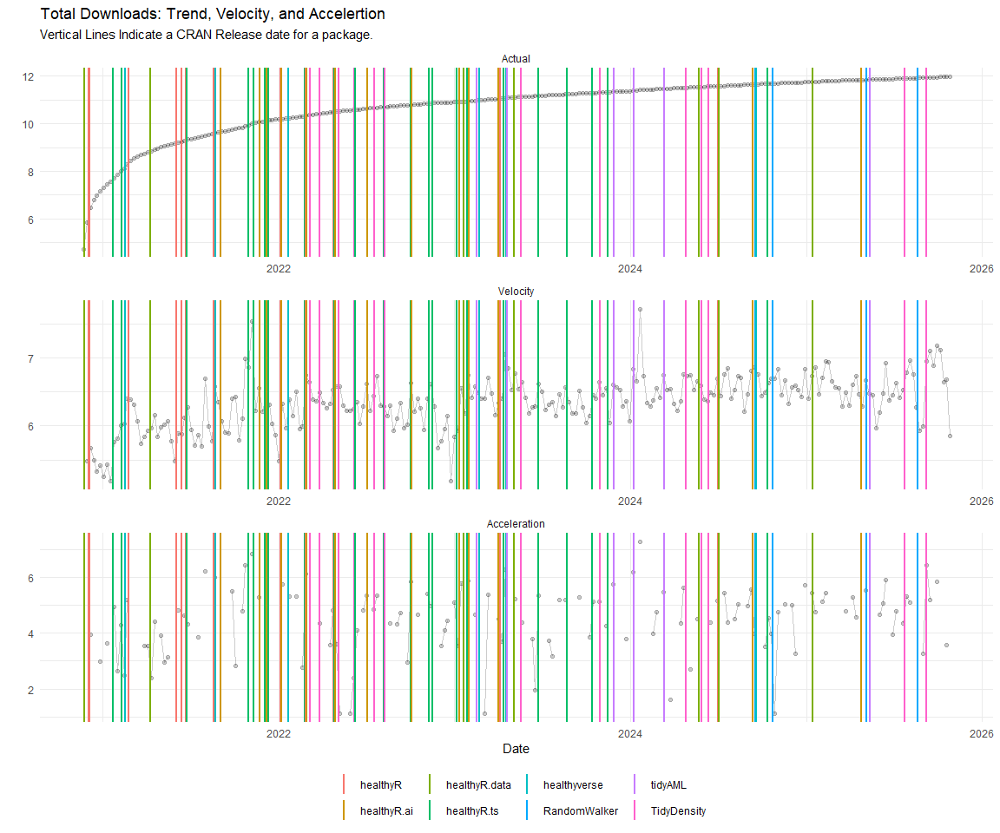
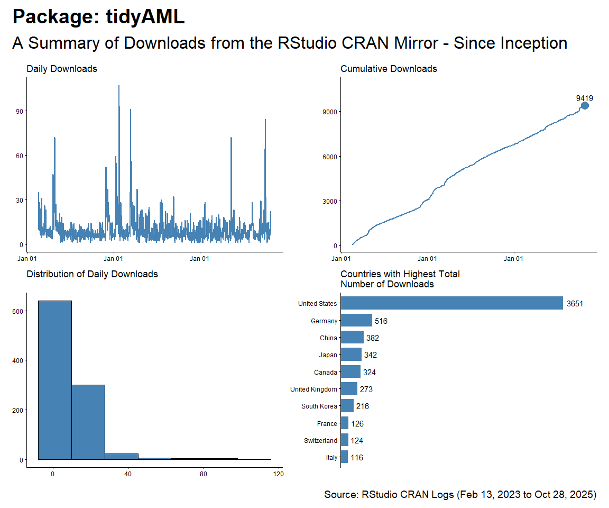
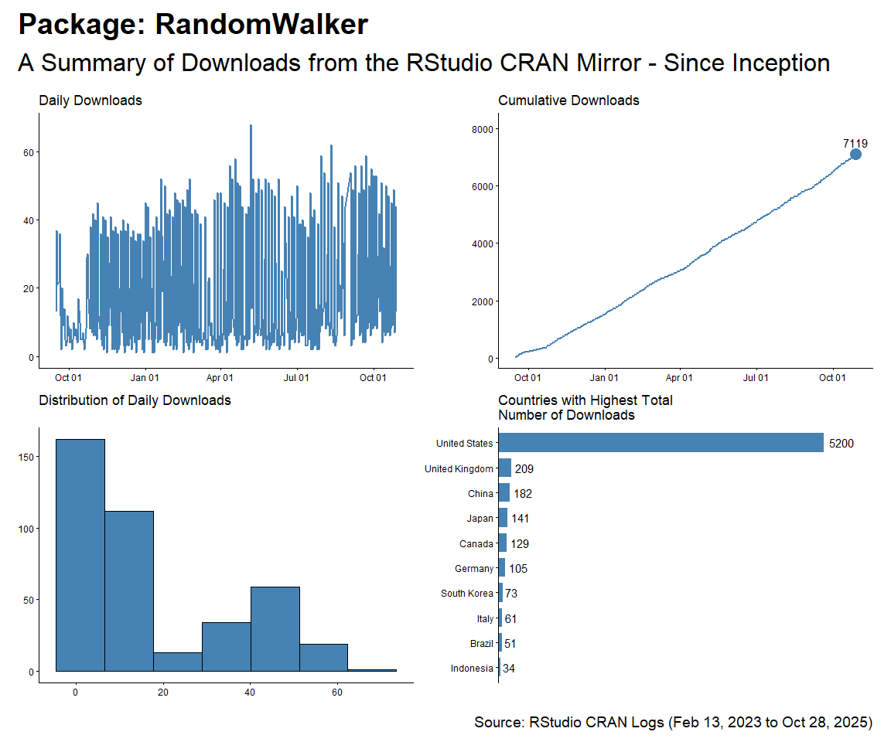

CRAN Downloads
================
Steven P. Sanderson II, MPH - Date:
09 September, 2025

This repo contains the analysis of downloads of my `R` packages:

- [`healthyR`](https://www.spsanderson.com/healthyR/)
- [`healthyR.data`](https://www.spsanderson.com/healthyR.data/)
- [`healthyR.ts`](https://www.spsanderson.com/healthyR.ts/)
- [`healthyR.ai`](https://www.spsanderson.com/healthyR.ai/)
- [`healthyverse`](https://www.spsanderson.com/healthyverse/)
- [`TidyDensity`](https://www.spsanderson.com/TidyDensity/)
- [`tidyAML`](https://www.spsanderson.com/tidyAML/)
- [`RandomWalker`](https://www.spsanderson.com/RandomWalker/)

All of which follow the [“analyses as
package”](https://rmflight.github.io/posts/2014/07/analyses_as_packages.html)
philosophy this repo itself is an `R` package that can installed using
`remotes::install_github()`.

I have forked this project itself from
[`ggcharts-analysis`](https://github.com/thomas-neitmann/ggcharts-downloads).

While I analyze `healthyverse` packages here, the functions are written
in a way that you can analyze any CRAN package with a slight
modification to the `download_log` function.

This file was last updated on September 09, 2025.

``` r
library(packagedownloads)
library(tidyverse)
library(patchwork)
library(timetk)
library(knitr)
library(leaflet)
library(htmltools)
library(tmaptools)
library(mapview)
library(countrycode)
library(htmlwidgets)
library(webshot)
library(rmarkdown)
library(dtplyr)
```

``` r
start_date      <- as.Date("2025-09-03")#Sys.Date() - 9 #as.Date("2020-11-15")
end_date        <- Sys.Date() - 2
total_downloads <- download_logs(start_date, end_date)
interactive     <- FALSE
pkg_release_date_tbl()
```

# Last Full Day Data

``` r
downloads            <- total_downloads |> filter(date == max(date))
daily_downloads      <- compute_daily_downloads(downloads)
downloads_by_country <- compute_downloads_by_country(downloads)

p1 <- plot_cumulative_downloads(daily_downloads)
p2 <- plot_downloads_by_country(downloads_by_country)

f <- function(date) format(date, "%b %d, %Y")
patchwork_theme <- theme_classic(base_size = 24) +
  theme(
    plot.title   = element_text(face = "bold"),
    plot.caption = element_text(size = 14)
  )
p1 + p2 +
  plot_annotation(
    title    = "healthyverse Packages - Last Full Day",
    subtitle = "A Summary of Downloads from the RStudio CRAN Mirror",
    caption  = glue::glue("Source: RStudio CRAN Logs for {f(end_date)}"),
    theme    = patchwork_theme
  )
```

<!-- -->

``` r
downloads |>
  count(package, version) |> 
  filter(grepl("[0-9]+\\.[0-9]+\\.[0-9]+", version)) |>
  tidyr::pivot_wider(
    id_cols       = version
    , names_from  = package
    , values_from = n
    , values_fill = 0
    ) |>
  arrange(version) |>
  kable()
```

| version | RandomWalker | TidyDensity | healthyR | healthyR.ai | healthyR.data | healthyR.ts | healthyverse | tidyAML |
|:---|---:|---:|---:|---:|---:|---:|---:|---:|
| 0.0.13 | 0 | 0 | 0 | 1 | 0 | 0 | 0 | 0 |
| 0.0.6 | 0 | 0 | 0 | 0 | 0 | 0 | 0 | 2 |
| 0.1.1 | 0 | 0 | 0 | 3 | 0 | 0 | 0 | 0 |
| 0.2.2 | 0 | 0 | 3 | 0 | 0 | 0 | 0 | 0 |
| 0.3.1 | 0 | 0 | 0 | 0 | 0 | 7 | 0 | 0 |
| 1.0.0 | 5 | 0 | 0 | 0 | 0 | 0 | 0 | 0 |
| 1.0.3 | 0 | 0 | 0 | 0 | 1 | 0 | 0 | 0 |
| 1.1.0 | 0 | 0 | 0 | 0 | 0 | 0 | 2 | 0 |
| 1.2.0 | 0 | 0 | 0 | 0 | 1 | 0 | 0 | 0 |
| 1.2.6 | 0 | 1 | 0 | 0 | 0 | 0 | 0 | 0 |
| 1.5.1 | 0 | 1 | 0 | 0 | 0 | 0 | 0 | 0 |
| 1.5.2 | 0 | 22 | 0 | 0 | 0 | 0 | 0 | 0 |

``` r
downloads |>
  count(package, sort = TRUE) |>
  tidyr::pivot_wider(
    names_from = package,
    values_from = n,
    values_fill = 0
  ) |>
  kable()
```

| TidyDensity | healthyR.ts | RandomWalker | healthyR.ai | healthyR | healthyR.data | healthyverse | tidyAML |
|---:|---:|---:|---:|---:|---:|---:|---:|
| 24 | 7 | 5 | 4 | 3 | 2 | 2 | 2 |

# Current Trend

Here are the current 7 day trends for the `healthyverse` suite of
packages.

``` r
downloads            <- total_downloads[date >= start_date]
daily_downloads      <- compute_daily_downloads(downloads)
downloads_by_country <- compute_downloads_by_country(downloads)

p1 <- plot_daily_downloads(daily_downloads)
p2 <- plot_cumulative_downloads(daily_downloads)
p3 <- hist_daily_downloads(daily_downloads)
p4 <- plot_downloads_by_country(downloads_by_country)

f <- function(date) format(date, "%b %d, %Y")
patchwork_theme <- theme_classic(base_size = 24) +
  theme(
    plot.title   = element_text(face = "bold"),
    plot.caption = element_text(size = 14)
  )
p1 + p2 + p3 + p4 +
  plot_annotation(
    title    = "healthyverse Packages - 7 Day Trend",
    subtitle = "A Summary of Downloads from the RStudio CRAN Mirror",
    caption  = glue::glue("Source: RStudio CRAN Logs ({f(start_date)} to {f(end_date)})"),
    theme    = patchwork_theme
  )
```

<!-- -->

# Since Inception

``` r
start_date <- as.Date("2020-11-15")

daily_downloads <- compute_daily_downloads(downloads = total_downloads)
downloads_by_country <- compute_downloads_by_country(downloads = total_downloads)

p1 <- plot_daily_downloads(daily_downloads)
p2 <- plot_cumulative_downloads(daily_downloads)
p3 <- hist_daily_downloads(daily_downloads)
p4 <- plot_downloads_by_country(downloads_by_country)

f <- function(date) format(date, "%b %d, %Y")
patchwork_theme <- theme_classic(base_size = 24) +
  theme(
    plot.title   = element_text(face = "bold"),
    plot.caption = element_text(size = 14)
  )
p1 + p2 + p3 + p4 +
  plot_annotation(
    title    = "healthyR packages are on the Rise",
    subtitle = "A Summary of Downloads from the RStudio CRAN Mirror - Since Inception",
    caption  = glue::glue("Source: RStudio CRAN Logs ({f(start_date)} to {f(end_date)})"),
    theme    = patchwork_theme
  )
```

<!-- -->

# By Release Date

``` r
pkg_tbl <- readRDS("pkg_release_tbl.rds")
dl_tbl <- total_downloads %>%
  filter(grepl(pattern = "[0-9]+\\.[0-9]+\\.[0-9]+", version)) %>%
    filter(
    date != "2024-05-29" &
      !(date == "2024-06-12" & package == "TidyDensity")
    ) |> # bad data on this for some reason
  group_by(package) %>%
  summarise_by_time(
    .date_var = date,
    .by = "week",
    N = n()
  ) %>%
  ungroup() %>%
  select(date, package, N)

dl_tbl %>%
ggplot(aes(date, log1p(N))) +
  theme_bw() +
  geom_point(aes(group = package, color = package), size = 1) +
  geom_line(aes(group = package, color = package)) +
  ggtitle(paste("Package Downloads: {healthyverse}")) +
  geom_smooth(method = "loess", color = "black",  se = FALSE) +
  geom_vline(
    data = pkg_tbl
    , aes(xintercept = as.numeric(date))
    , color = "red"
    , lwd = 1
    , lty = "solid"
  ) +
  facet_wrap(package ~., ncol = 2, scales = "free_x") +
  theme_minimal() +
  labs(
    subtitle = "Vertical lines represent release dates",
    x = "Date",
    y = "log1p(Counts)",
    color = "Package"
  ) +
  theme(legend.position = "bottom")
```

<!-- -->

``` r
dl_tbl %>%
  select(date, N) %>%
  summarise_by_time(
    .date_var = date,
    .by = "week",
    Actual = sum(N, na.rm = TRUE)
  ) %>%
  mutate(Actual = cumsum(Actual)) %>%
  tk_augment_differences(.value = Actual, .differences = 1) %>%
  tk_augment_differences(.value = Actual, .differences = 2) %>%
  rename(velocity = contains("_diff1")) %>%
  rename(acceleration = contains("_diff2")) %>%
  pivot_longer(-date) %>%
  mutate(name = str_to_title(name)) %>%
  mutate(name = as_factor(name)) %>%
  ggplot(aes(x = date, y = log1p(value), group = name)) +
  geom_point(alpha = .2) +
  geom_line(alpha = .2) +
  geom_vline(
    data = pkg_tbl
    , aes(xintercept = as.numeric(date), color = package)
    , lwd = 1
    , lty = "solid"
  ) +
  facet_wrap(name ~ ., ncol = 1, scale = "free") +
  theme_minimal() +
  labs(
    title = "Total Downloads: Trend, Velocity, and Accelertion",
    subtitle = "Vertical Lines Indicate a CRAN Release date for a package.",
    x = "Date",
    y = "",
    color = ""
  ) +
  theme(legend.position = "bottom")
```

<!-- -->

# Map of Downloads

A `leaflet` map of countries where a package has been downloaded.

``` r
mapping_dataset() %>%
  head() %>%
  knitr::kable()
```

| country | latitude | longitude | display_name | icon |
|:---|---:|---:|:---|:---|
| United States | 39.78373 | -100.445882 | United States | <https://nominatim.openstreetmap.org/ui/mapicons/poi_boundary_administrative.p.20.png> |
| United Kingdom | 54.70235 | -3.276575 | United Kingdom | <https://nominatim.openstreetmap.org/ui/mapicons/poi_boundary_administrative.p.20.png> |
| Germany | 51.16382 | 10.447831 | Deutschland | <https://nominatim.openstreetmap.org/ui/mapicons/poi_boundary_administrative.p.20.png> |
| Hong Kong SAR China | 22.35063 | 114.184916 | 香港 Hong Kong, 中国 | <https://nominatim.openstreetmap.org/ui/mapicons/poi_boundary_administrative.p.20.png> |
| Japan | 36.57484 | 139.239418 | 日本 | <https://nominatim.openstreetmap.org/ui/mapicons/poi_boundary_administrative.p.20.png> |
| Chile | -31.76134 | -71.318770 | Chile | <https://nominatim.openstreetmap.org/ui/mapicons/poi_boundary_administrative.p.20.png> |

``` r
l <- map_leaflet()
saveWidget(l, "downloads_map.html")
webshot("downloads_map.html", file = "map.png",
        cliprect = "viewport")
```

<!-- -->

To date there has been downloads in a total of 161 different countries.

# Analysis by Package

## healthyR

``` r
start_date <- as.Date("2020-11-15")
pkg <- "healthyR"

daily_downloads <- compute_daily_downloads(
  downloads = total_downloads
  , pkg = pkg)
downloads_by_country <- compute_downloads_by_country(
  downloads = total_downloads
  , pkg = pkg)

p1 <- plot_daily_downloads(daily_downloads)
p2 <- plot_cumulative_downloads(daily_downloads)
p3 <- hist_daily_downloads(daily_downloads)
p4 <- plot_downloads_by_country(downloads_by_country)

f <- function(date) format(date, "%b %d, %Y")
patchwork_theme <- theme_classic(base_size = 24) +
  theme(
    plot.title   = element_text(face = "bold"),
    plot.caption = element_text(size = 14)
  )
p1 + p2 + p3 + p4 +
  plot_annotation(
    title    = glue::glue("Package: {pkg}"),
    subtitle = "A Summary of Downloads from the RStudio CRAN Mirror - Since Inception",
    caption  = glue::glue("Source: RStudio CRAN Logs ({f(start_date)} to {f(end_date)})"),
    theme    = patchwork_theme
  )
```

<!-- -->

## healthyR.ts

``` r
start_date <- as.Date("2020-11-15")
pkg <- "healthyR.ts"

daily_downloads <- compute_daily_downloads(
  downloads = total_downloads
  , pkg = pkg)
downloads_by_country <- compute_downloads_by_country(
  downloads = total_downloads
  , pkg = pkg)

p1 <- plot_daily_downloads(daily_downloads)
p2 <- plot_cumulative_downloads(daily_downloads)
p3 <- hist_daily_downloads(daily_downloads)
p4 <- plot_downloads_by_country(downloads_by_country)

f <- function(date) format(date, "%b %d, %Y")
patchwork_theme <- theme_classic(base_size = 24) +
  theme(
    plot.title   = element_text(face = "bold"),
    plot.caption = element_text(size = 14)
  )
p1 + p2 + p3 + p4 +
  plot_annotation(
    title    = glue::glue("Package: {pkg}"),
    subtitle = "A Summary of Downloads from the RStudio CRAN Mirror - Since Inception",
    caption  = glue::glue("Source: RStudio CRAN Logs ({f(start_date)} to {f(end_date)})"),
    theme    = patchwork_theme
  )
```

<!-- -->

## healthyR.data

``` r
start_date <- as.Date("2020-11-15")
pkg <- "healthyR.data"

daily_downloads <- compute_daily_downloads(
  downloads = total_downloads
  , pkg = pkg)
downloads_by_country <- compute_downloads_by_country(
  downloads = total_downloads
  , pkg = pkg)

p1 <- plot_daily_downloads(daily_downloads)
p2 <- plot_cumulative_downloads(daily_downloads)
p3 <- hist_daily_downloads(daily_downloads)
p4 <- plot_downloads_by_country(downloads_by_country)

f <- function(date) format(date, "%b %d, %Y")
patchwork_theme <- theme_classic(base_size = 24) +
  theme(
    plot.title   = element_text(face = "bold"),
    plot.caption = element_text(size = 14)
  )
p1 + p2 + p3 + p4 +
  plot_annotation(
    title    = glue::glue("Package: {pkg}"),
    subtitle = "A Summary of Downloads from the RStudio CRAN Mirror - Since Inception",
    caption  = glue::glue("Source: RStudio CRAN Logs ({f(start_date)} to {f(end_date)})"),
    theme    = patchwork_theme
  )
```

<!-- -->

## healthyR.ai

``` r
start_date <- as.Date("2020-11-15")
pkg <- "healthyR.ai"

daily_downloads <- compute_daily_downloads(
  downloads = total_downloads
  , pkg = pkg)
downloads_by_country <- compute_downloads_by_country(
  downloads = total_downloads
  , pkg = pkg)

p1 <- plot_daily_downloads(daily_downloads)
p2 <- plot_cumulative_downloads(daily_downloads)
p3 <- hist_daily_downloads(daily_downloads)
p4 <- plot_downloads_by_country(downloads_by_country)

f <- function(date) format(date, "%b %d, %Y")
patchwork_theme <- theme_classic(base_size = 24) +
  theme(
    plot.title   = element_text(face = "bold"),
    plot.caption = element_text(size = 14)
  )
p1 + p2 + p3 + p4 +
  plot_annotation(
    title    = glue::glue("Package: {pkg}"),
    subtitle = "A Summary of Downloads from the RStudio CRAN Mirror - Since Inception",
    caption  = glue::glue("Source: RStudio CRAN Logs ({f(start_date)} to {f(end_date)})"),
    theme    = patchwork_theme
  )
```

<!-- -->

## healthyverse

``` r
start_date <- as.Date("2020-11-15")
pkg <- "healthyverse"

daily_downloads <- compute_daily_downloads(
  downloads = total_downloads
  , pkg = pkg)
downloads_by_country <- compute_downloads_by_country(
  downloads = total_downloads
  , pkg = pkg)

p1 <- plot_daily_downloads(daily_downloads)
p2 <- plot_cumulative_downloads(daily_downloads)
p3 <- hist_daily_downloads(daily_downloads)
p4 <- plot_downloads_by_country(downloads_by_country)

f <- function(date) format(date, "%b %d, %Y")
patchwork_theme <- theme_classic(base_size = 24) +
  theme(
    plot.title   = element_text(face = "bold"),
    plot.caption = element_text(size = 14)
  )
p1 + p2 + p3 + p4 +
  plot_annotation(
    title    = glue::glue("Package: {pkg}"),
    subtitle = "A Summary of Downloads from the RStudio CRAN Mirror - Since Inception",
    caption  = glue::glue("Source: RStudio CRAN Logs ({f(start_date)} to {f(end_date)})"),
    theme    = patchwork_theme
  )
```

<!-- -->

## TidyDensity

``` r
start_date <- as.Date("2020-11-15")
pkg <- "TidyDensity"

daily_downloads <- compute_daily_downloads(
  downloads = total_downloads
  , pkg = pkg)
downloads_by_country <- compute_downloads_by_country(
  downloads = total_downloads
  , pkg = pkg)

p1 <- plot_daily_downloads(daily_downloads)
p2 <- plot_cumulative_downloads(daily_downloads)
p3 <- hist_daily_downloads(daily_downloads)
p4 <- plot_downloads_by_country(downloads_by_country)

f <- function(date) format(date, "%b %d, %Y")
patchwork_theme <- theme_classic(base_size = 24) +
  theme(
    plot.title   = element_text(face = "bold"),
    plot.caption = element_text(size = 14)
  )
p1 + p2 + p3 + p4 +
  plot_annotation(
    title    = glue::glue("Package: {pkg}"),
    subtitle = "A Summary of Downloads from the RStudio CRAN Mirror - Since Inception",
    caption  = glue::glue("Source: RStudio CRAN Logs ({f(start_date)} to {f(end_date)})"),
    theme    = patchwork_theme
  )
```

<!-- -->

## tidyAML

``` r
start_date <- as.Date("2023-02-13")
pkg <- "tidyAML"

daily_downloads <- compute_daily_downloads(
  downloads = total_downloads
  , pkg = pkg)
downloads_by_country <- compute_downloads_by_country(
  downloads = total_downloads
  , pkg = pkg)

p1 <- plot_daily_downloads(daily_downloads)
p2 <- plot_cumulative_downloads(daily_downloads)
p3 <- hist_daily_downloads(daily_downloads)
p4 <- plot_downloads_by_country(downloads_by_country)

f <- function(date) format(date, "%b %d, %Y")
patchwork_theme <- theme_classic(base_size = 24) +
  theme(
    plot.title   = element_text(face = "bold"),
    plot.caption = element_text(size = 14)
  )
p1 + p2 + p3 + p4 +
  plot_annotation(
    title    = glue::glue("Package: {pkg}"),
    subtitle = "A Summary of Downloads from the RStudio CRAN Mirror - Since Inception",
    caption  = glue::glue("Source: RStudio CRAN Logs ({f(start_date)} to {f(end_date)})"),
    theme    = patchwork_theme
  )
```

<!-- -->

## RandomWalker

``` r
start_date <- as.Date("2023-02-13")
pkg <- "RandomWalker"

daily_downloads <- compute_daily_downloads(
  downloads = total_downloads
  , pkg = pkg)
downloads_by_country <- compute_downloads_by_country(
  downloads = total_downloads
  , pkg = pkg)

p1 <- plot_daily_downloads(daily_downloads)
p2 <- plot_cumulative_downloads(daily_downloads)
p3 <- hist_daily_downloads(daily_downloads)
p4 <- plot_downloads_by_country(downloads_by_country)

f <- function(date) format(date, "%b %d, %Y")
patchwork_theme <- theme_classic(base_size = 24) +
  theme(
    plot.title   = element_text(face = "bold"),
    plot.caption = element_text(size = 14)
  )
p1 + p2 + p3 + p4 +
  plot_annotation(
    title    = glue::glue("Package: {pkg}"),
    subtitle = "A Summary of Downloads from the RStudio CRAN Mirror - Since Inception",
    caption  = glue::glue("Source: RStudio CRAN Logs ({f(start_date)} to {f(end_date)})"),
    theme    = patchwork_theme
  )
```

<!-- -->

# Table Data

### Downloads by Package and Version

``` r
total_downloads %>% 
  count(package, version) %>% 
  filter(grepl(pattern = "[0-9]+\\.[0-9]+\\.[0-9]+", version)) %>%
  filter(!str_detect(version, "tar.gz")) %>%
  tidyr::pivot_wider(
    id_cols       = version
    , names_from  = package
    , values_from = n
    , values_fill = 0
    ) %>%
  arrange(version) %>%
  kable()
```

| version | RandomWalker | TidyDensity | healthyR | healthyR.ai | healthyR.data | healthyR.ts | healthyverse | tidyAML |
|:---|---:|---:|---:|---:|---:|---:|---:|---:|
| 0.0.1 | 0 | 1329 | 0 | 650 | 0 | 0 | 0 | 960 |
| 0.0.10 | 0 | 0 | 0 | 775 | 0 | 0 | 0 | 0 |
| 0.0.11 | 0 | 0 | 0 | 610 | 0 | 0 | 0 | 0 |
| 0.0.12 | 0 | 0 | 0 | 865 | 0 | 0 | 0 | 0 |
| 0.0.13 | 0 | 0 | 0 | 4281 | 0 | 0 | 0 | 0 |
| 0.0.2 | 0 | 0 | 0 | 1902 | 0 | 0 | 0 | 2082 |
| 0.0.3 | 0 | 0 | 0 | 665 | 0 | 0 | 0 | 780 |
| 0.0.4 | 0 | 0 | 0 | 747 | 0 | 0 | 0 | 992 |
| 0.0.5 | 0 | 0 | 0 | 1329 | 0 | 0 | 0 | 3151 |
| 0.0.6 | 0 | 0 | 0 | 2687 | 0 | 0 | 0 | 819 |
| 0.0.7 | 0 | 0 | 0 | 999 | 0 | 0 | 0 | 0 |
| 0.0.8 | 0 | 0 | 0 | 1122 | 0 | 0 | 0 | 0 |
| 0.0.9 | 0 | 0 | 0 | 916 | 0 | 0 | 0 | 0 |
| 0.1.0 | 444 | 0 | 537 | 1665 | 0 | 770 | 0 | 0 |
| 0.1.1 | 0 | 0 | 1582 | 986 | 0 | 2294 | 0 | 0 |
| 0.1.2 | 0 | 0 | 1809 | 0 | 0 | 1285 | 0 | 0 |
| 0.1.3 | 0 | 0 | 611 | 0 | 0 | 1403 | 0 | 0 |
| 0.1.4 | 0 | 0 | 662 | 0 | 0 | 980 | 0 | 0 |
| 0.1.5 | 0 | 0 | 1303 | 0 | 0 | 814 | 0 | 0 |
| 0.1.6 | 0 | 0 | 2511 | 0 | 0 | 554 | 0 | 0 |
| 0.1.7 | 0 | 0 | 1297 | 0 | 0 | 1546 | 0 | 0 |
| 0.1.8 | 0 | 0 | 2420 | 0 | 0 | 2420 | 0 | 0 |
| 0.1.9 | 0 | 0 | 1164 | 0 | 0 | 789 | 0 | 0 |
| 0.2.0 | 3445 | 0 | 2414 | 0 | 0 | 792 | 0 | 0 |
| 0.2.1 | 0 | 0 | 4867 | 0 | 0 | 605 | 0 | 0 |
| 0.2.10 | 0 | 0 | 0 | 0 | 0 | 690 | 0 | 0 |
| 0.2.11 | 0 | 0 | 0 | 0 | 0 | 723 | 0 | 0 |
| 0.2.2 | 0 | 0 | 3257 | 0 | 0 | 829 | 0 | 0 |
| 0.2.3 | 0 | 0 | 0 | 0 | 0 | 839 | 0 | 0 |
| 0.2.4 | 0 | 0 | 0 | 0 | 0 | 465 | 0 | 0 |
| 0.2.5 | 0 | 0 | 0 | 0 | 0 | 758 | 0 | 0 |
| 0.2.6 | 0 | 0 | 0 | 0 | 0 | 621 | 0 | 0 |
| 0.2.7 | 0 | 0 | 0 | 0 | 0 | 1006 | 0 | 0 |
| 0.2.8 | 0 | 0 | 0 | 0 | 0 | 2757 | 0 | 0 |
| 0.2.9 | 0 | 0 | 0 | 0 | 0 | 907 | 0 | 0 |
| 0.3.0 | 1823 | 0 | 0 | 0 | 0 | 3142 | 0 | 0 |
| 0.3.1 | 0 | 0 | 0 | 0 | 0 | 2329 | 0 | 0 |
| 1.0.0 | 251 | 684 | 0 | 0 | 3186 | 0 | 2658 | 0 |
| 1.0.1 | 0 | 2225 | 0 | 0 | 10420 | 0 | 2461 | 0 |
| 1.0.2 | 0 | 0 | 0 | 0 | 2206 | 0 | 3882 | 0 |
| 1.0.3 | 0 | 0 | 0 | 0 | 3764 | 0 | 643 | 0 |
| 1.0.4 | 0 | 0 | 0 | 0 | 0 | 0 | 3717 | 0 |
| 1.1.0 | 0 | 723 | 0 | 0 | 675 | 0 | 2014 | 0 |
| 1.1.1 | 0 | 0 | 0 | 0 | 1279 | 0 | 0 | 0 |
| 1.2.0 | 0 | 808 | 0 | 0 | 1412 | 0 | 0 | 0 |
| 1.2.1 | 0 | 622 | 0 | 0 | 0 | 0 | 0 | 0 |
| 1.2.2 | 0 | 835 | 0 | 0 | 0 | 0 | 0 | 0 |
| 1.2.3 | 0 | 869 | 0 | 0 | 0 | 0 | 0 | 0 |
| 1.2.4 | 0 | 3374 | 0 | 0 | 0 | 0 | 0 | 0 |
| 1.2.5 | 0 | 2063 | 0 | 0 | 0 | 0 | 0 | 0 |
| 1.2.6 | 0 | 1328 | 0 | 0 | 0 | 0 | 0 | 0 |
| 1.3.0 | 0 | 1840 | 0 | 0 | 0 | 0 | 0 | 0 |
| 1.4.0 | 0 | 1272 | 0 | 0 | 0 | 0 | 0 | 0 |
| 1.5.0 | 0 | 5179 | 0 | 0 | 0 | 0 | 0 | 0 |
| 1.5.1 | 0 | 658 | 0 | 0 | 0 | 0 | 0 | 0 |
| 1.5.2 | 0 | 65 | 0 | 0 | 0 | 0 | 0 | 0 |

``` r
total_downloads %>%
  count(package, sort = TRUE) %>%
  kable()
```

| package       |     n |
|:--------------|------:|
| healthyR.ts   | 29333 |
| healthyR      | 24439 |
| TidyDensity   | 23878 |
| healthyR.data | 22942 |
| healthyR.ai   | 20204 |
| healthyverse  | 15375 |
| tidyAML       |  8784 |
| RandomWalker  |  5963 |

# Cumulative Downloads by Package

``` r
p1 <- plot_cumulative_downloads_pkg(total_downloads, pkg = "healthyR")
p2 <- plot_cumulative_downloads_pkg(total_downloads, pkg = "healthyR.ts")
p3 <- plot_cumulative_downloads_pkg(total_downloads, pkg = "healthyR.data")
p4 <- plot_cumulative_downloads_pkg(total_downloads, pkg = "healthyverse")
p5 <- plot_cumulative_downloads_pkg(total_downloads, pkg = "healthyR.ai")
p6 <- plot_cumulative_downloads_pkg(total_downloads, pkg = "TidyDensity")
p7 <- plot_cumulative_downloads_pkg(total_downloads, pkg = "tidyAML")
p8 <- plot_cumulative_downloads_pkg(total_downloads, pkg = "RandomWalker")

f <- function(date) format(date, "%b %d, %Y")
patchwork_theme <- theme_classic(base_size = 24) +
  theme(
    plot.title   = element_text(face = "bold"),
    plot.caption = element_text(size = 14)
  )
p1 + p2 + p3 + p4 + p5 + p6 + p7 + p8 +
  plot_annotation(
    title    = "healthyR packages are on the Rise",
    subtitle = "A Summary of Downloads from the RStudio CRAN Mirror - Since Inception",
    caption  = glue::glue("Source: RStudio CRAN Logs ({f(start_date)} to {f(end_date)})"),
    theme    = patchwork_theme
  )
```

<!-- -->

# Thirty Day Run Post Release

``` r
pkg_rel <- readRDS("pkg_release_tbl.rds") |>
  # Filter out bad data, not sure why it occurrs. 
  filter(
    date != "2024-05-29" &
      !(date == "2024-06-12" & package == "TidyDensity")
    ) |>
  arrange(date) |>
  group_by(package) |>
  mutate(rel_no = row_number()) |>
  ungroup()

thirty_day_runup_tbl <- total_downloads |>
  lazy_dt() |>
  select(date, package, version) |>
  group_by(date, package, version) |>
  summarise(dl_count = n()) |>
  ungroup() |>
  arrange(date) |>
  group_by(package, version) |>
  mutate(rec_no = row_number()) |>
  mutate(cum_dl = cumsum(dl_count)) |>
  filter(rec_no < 31) |>
  ungroup() |>
  mutate(pkg_ver = paste0(package, "-", version)) |>
  collect()

release_tbl <- left_join(
  x = thirty_day_runup_tbl,
  y = pkg_rel
) |>
  group_by(package) |>
  fill(release_record, .direction = "down") |>
  fill(rel_no, .direction = "down") |>
  mutate(
    release_record = as.factor(release_record),
    rel_no = as.factor(rel_no)
  ) |>
  ungroup()

latest_group_tbl <- release_tbl |>
  group_by(package) |> 
  arrange(date, rec_no) |>
  mutate(group_no = as.numeric(rel_no)) |> 
  filter(group_no == max(group_no)) |>
  ungroup()

joined_tbl <- left_join(
  x = thirty_day_runup_tbl, 
  y = latest_group_tbl
  ) |>
  mutate(group_no = ifelse(is.na(group_no), FALSE, TRUE))

joined_tbl |>
  ggplot(aes(x = rec_no, y = dl_count, group = as.factor(pkg_ver))) +
  facet_wrap(~ package, scales = "free", ncol = 3) +
  geom_line(aes(col = group_no)) +
  scale_color_manual(values = c("FALSE" = "grey", "TRUE" = "red")) +
  theme_minimal() +
  labs(
    y = "Downloads",
    x = "Day After Version Release",
    col = "Latest Release"
  )
```

<!-- -->

``` r
joined_tbl |>
  ggplot(aes(x = rec_no, y = cum_dl, group = as.factor(pkg_ver))) +
  facet_wrap(~ package, scales = "free", ncol = 3) +
  geom_line(aes(col = group_no)) +
  scale_color_manual(values = c("FALSE" = "grey", "TRUE" = "red")) +
  theme_minimal() +
  labs(
    y = "Downloads",
    x = "Day After Version Release",
    col = "Latest Release"
  )
```

<!-- -->
