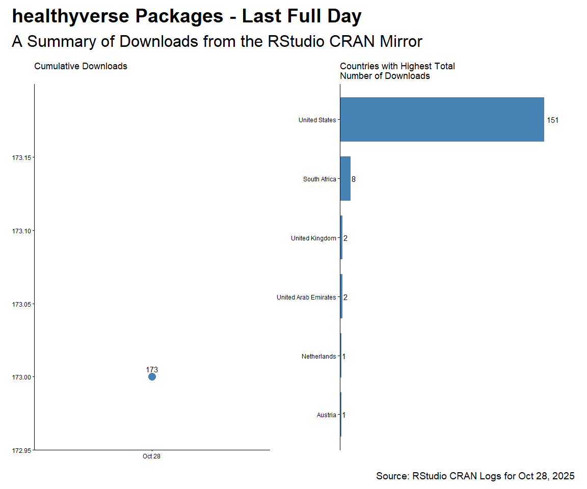

CRAN Downloads
================
Steven P. Sanderson II, MPH - Date:
03 May, 2023

This repo contains the analysis of downloads of my `R` packages:

- [`healthyR`](https://www.spsanderson.com/healthyR/)
- [`healthyR.data`](https://www.spsanderson.com/healthyR.data/)
- [`healthyR.ts`](https://www.spsanderson.com/healthyR.ts/)
- [`healthyR.ai`](https://www.spsanderson.com/healthyR.ai/)
- [`healthyverse`](https://www.spsanderson.com/healthyverse/)
- [`TidyDensity`](https://www.spsanderson.com/TidyDensity/)
- [`tidyAML`](https://www.spsanderson.com/tidyAML/)

All of which follow the [“analyses as
package”](https://rmflight.github.io/posts/2014/07/analyses_as_packages.html)
philosophy this repo itself is an `R` package that can installed using
`remotes::install_github()`.

I have forked this project itself from
[`ggcharts-analysis`](https://github.com/thomas-neitmann/ggcharts-downloads).

While I analyze `healthyverse` packages here, the functions are written
in a way that you can analyze any CRAN package with a slight
modification to the `download_log` function.

This file was last updated on May 03, 2023.

``` r
library(packagedownloads)
library(tidyverse)
library(patchwork)
library(timetk)
library(knitr)
library(leaflet)
library(htmltools)
library(tmaptools)
library(mapview)
library(countrycode)
library(htmlwidgets)
library(webshot)
library(rmarkdown)
```

``` r
start_date      <- Sys.Date() - 9 #as.Date("2020-11-15")
end_date        <- Sys.Date() - 2
total_downloads <- download_logs(start_date, end_date)
interactive     <- FALSE
pkg_release_date_tbl()
```

# Last Full Day Data

``` r
downloads            <- total_downloads %>% filter(date == max(date))
daily_downloads      <- compute_daily_downloads(downloads)
downloads_by_country <- compute_downloads_by_country(downloads)

p2 <- plot_cumulative_downloads(daily_downloads)
p4 <- plot_downloads_by_country(downloads_by_country)

f <- function(date) format(date, "%b %d, %Y")
patchwork_theme <- theme_classic(base_size = 24) +
  theme(
    plot.title   = element_text(face = "bold"),
    plot.caption = element_text(size = 14)
  )
p2 + p4 +
  plot_annotation(
    title    = "healthyverse Packages - Last Full Day",
    subtitle = "A Summary of Downloads from the RStudio CRAN Mirror",
    caption  = glue::glue("Source: RStudio CRAN Logs for {f(end_date)}"),
    theme    = patchwork_theme
  )
```

<!-- -->

``` r
downloads %>% 
  count(package, version) %>% 
  tidyr::pivot_wider(
    id_cols       = version
    , names_from  = package
    , values_from = n
    , values_fill = 0
    ) %>% 
  arrange(version) %>%
  kable()
```

| version | TidyDensity | healthyR | healthyR.ai | healthyR.data | healthyR.ts | healthyverse | tidyAML |
|:--------|------------:|---------:|------------:|--------------:|------------:|-------------:|--------:|
| 0.0.13  |           0 |        0 |           6 |             0 |           0 |            0 |       0 |
| 0.0.2   |           0 |        0 |           0 |             0 |           0 |            0 |      27 |
| 0.0.6   |           0 |        0 |           4 |             0 |           0 |            0 |       0 |
| 0.1.8   |           0 |        3 |           0 |             0 |           3 |            0 |       0 |
| 0.2.1   |           0 |        7 |           0 |             0 |           0 |            0 |       0 |
| 0.2.8   |           0 |        0 |           0 |             0 |          12 |            0 |       0 |
| 1.0.1   |           3 |        0 |           0 |             9 |           0 |            0 |       0 |
| 1.0.2   |           0 |        0 |           0 |            11 |           0 |            3 |       0 |
| 1.0.4   |           0 |        0 |           0 |             0 |           0 |           11 |       0 |
| 1.2.4   |          13 |        0 |           0 |             0 |           0 |            0 |       0 |

``` r
downloads %>%
  count(package) %>%
  tidyr::pivot_wider(
    names_from = package,
    values_from = n,
    values_fill = 0
  ) %>%
  kable()
```

| TidyDensity | healthyR | healthyR.ai | healthyR.data | healthyR.ts | healthyverse | tidyAML |
|------------:|---------:|------------:|--------------:|------------:|-------------:|--------:|
|          16 |       10 |          10 |            20 |          15 |           14 |      27 |

# Current Trend

Here are the current 7 day trends for the `healthyverse` suite of
packages.

``` r
downloads            <- total_downloads[date >= start_date]
daily_downloads      <- compute_daily_downloads(downloads)
downloads_by_country <- compute_downloads_by_country(downloads)

p1 <- plot_daily_downloads(daily_downloads)
p2 <- plot_cumulative_downloads(daily_downloads)
p3 <- hist_daily_downloads(daily_downloads)
p4 <- plot_downloads_by_country(downloads_by_country)

f <- function(date) format(date, "%b %d, %Y")
patchwork_theme <- theme_classic(base_size = 24) +
  theme(
    plot.title   = element_text(face = "bold"),
    plot.caption = element_text(size = 14)
  )
p1 + p2 + p3 + p4 +
  plot_annotation(
    title    = "healthyverse Packages - 7 Day Trend",
    subtitle = "A Summary of Downloads from the RStudio CRAN Mirror",
    caption  = glue::glue("Source: RStudio CRAN Logs ({f(start_date)} to {f(end_date)})"),
    theme    = patchwork_theme
  )
```

<!-- -->

# Since Inception

``` r
start_date <- as.Date("2020-11-15")

daily_downloads <- compute_daily_downloads(downloads = total_downloads)
downloads_by_country <- compute_downloads_by_country(downloads = total_downloads)

p1 <- plot_daily_downloads(daily_downloads)
p2 <- plot_cumulative_downloads(daily_downloads)
p3 <- hist_daily_downloads(daily_downloads)
p4 <- plot_downloads_by_country(downloads_by_country)

f <- function(date) format(date, "%b %d, %Y")
patchwork_theme <- theme_classic(base_size = 24) +
  theme(
    plot.title   = element_text(face = "bold"),
    plot.caption = element_text(size = 14)
  )
p1 + p2 + p3 + p4 +
  plot_annotation(
    title    = "healthyR packages are on the Rise",
    subtitle = "A Summary of Downloads from the RStudio CRAN Mirror - Since Inception",
    caption  = glue::glue("Source: RStudio CRAN Logs ({f(start_date)} to {f(end_date)})"),
    theme    = patchwork_theme
  )
```

<!-- -->

# By Release Date

``` r
pkg_tbl <- readRDS("pkg_release_tbl.rds")
dl_tbl <- total_downloads %>%
  group_by(package) %>%
  summarise_by_time(
    .date_var = date,
    .by = "week",
    N = n()
  ) %>%
  ungroup() %>%
  select(date, package, N)

dl_tbl %>%
ggplot(aes(date, log1p(N))) +
  theme_bw() +
  geom_point(aes(group = package, color = package), size = 1) +
  geom_line(aes(group = package, color = package)) +
  ggtitle(paste("Package Downloads: {healthyverse}")) +
  geom_smooth(method = "loess", color = "black",  se = FALSE) +
  geom_vline(
    data = pkg_tbl
    , aes(xintercept = as.numeric(date))
    , color = "red"
    , lwd = 1
    , lty = "solid"
  ) +
  facet_wrap(package ~., ncol = 2, scales = "free_x") +
  theme_minimal() +
  labs(
    subtitle = "Vertical lines represent release dates",
    x = "Date",
    y = "log1p(Counts)",
    color = "Package"
  ) +
  theme(legend.position = "bottom")
```

<!-- -->

``` r
dl_tbl %>%
  select(date, N) %>%
  summarise_by_time(
    .date_var = date,
    .by = "week",
    Actual = sum(N, na.rm = TRUE)
  ) %>%
  tk_augment_differences(.value = Actual, .differences = 1) %>%
  tk_augment_differences(.value = Actual, .differences = 2) %>%
  rename(velocity = contains("_diff1")) %>%
  rename(acceleration = contains("_diff2")) %>%
  pivot_longer(-date) %>%
  mutate(name = str_to_title(name)) %>%
  mutate(name = as_factor(name)) %>%
  ggplot(aes(x = date, y = log1p(value), group = name)) +
  geom_point(alpha = .2) +
  geom_vline(
    data = pkg_tbl
    , aes(xintercept = as.numeric(date), color = package)
    , lwd = 1
    , lty = "solid"
  ) +
  facet_wrap(name ~ ., ncol = 1, scale = "free") +
  theme_minimal() +
  labs(
    title = "Total Downloads: Trend, Velocity, and Accelertion",
    subtitle = "Vertical Lines Indicate a CRAN Release date for a package.",
    x = "Date",
    y = "",
    color = ""
  ) +
  theme(legend.position = "bottom")
```

<!-- -->

# Map of Downloads

A `leaflet` map of countries where a package has been downloaded.

``` r
mapping_dataset() %>%
  head() %>%
  knitr::kable()
```

| country             |  latitude |   longitude | display_name         | icon                                                                                   |
|:--------------------|----------:|------------:|:---------------------|:---------------------------------------------------------------------------------------|
| United States       |  39.78373 | -100.445882 | United States        | <https://nominatim.openstreetmap.org/ui/mapicons/poi_boundary_administrative.p.20.png> |
| United Kingdom      |  54.70235 |   -3.276575 | United Kingdom       | <https://nominatim.openstreetmap.org/ui/mapicons/poi_boundary_administrative.p.20.png> |
| Germany             |  51.16382 |   10.447831 | Deutschland          | <https://nominatim.openstreetmap.org/ui/mapicons/poi_boundary_administrative.p.20.png> |
| Hong Kong SAR China |  22.35063 |  114.184916 | 香港 Hong Kong, 中国 | <https://nominatim.openstreetmap.org/ui/mapicons/poi_boundary_administrative.p.20.png> |
| Japan               |  36.57484 |  139.239418 | 日本                 | <https://nominatim.openstreetmap.org/ui/mapicons/poi_boundary_administrative.p.20.png> |
| Chile               | -31.76134 |  -71.318770 | Chile                | <https://nominatim.openstreetmap.org/ui/mapicons/poi_boundary_administrative.p.20.png> |

``` r
l <- map_leaflet()
saveWidget(l, "downloads_map.html")
webshot("downloads_map.html", file = "map.png",
        cliprect = "viewport")
```

<!-- -->

To date there has been downloads in a total of 134 different countries.

# Analysis by Package

## healthyR

``` r
start_date <- as.Date("2020-11-15")
pkg <- "healthyR"

daily_downloads <- compute_daily_downloads(
  downloads = total_downloads
  , pkg = pkg)
downloads_by_country <- compute_downloads_by_country(
  downloads = total_downloads
  , pkg = pkg)

p1 <- plot_daily_downloads(daily_downloads)
p2 <- plot_cumulative_downloads(daily_downloads)
p3 <- hist_daily_downloads(daily_downloads)
p4 <- plot_downloads_by_country(downloads_by_country)

f <- function(date) format(date, "%b %d, %Y")
patchwork_theme <- theme_classic(base_size = 24) +
  theme(
    plot.title   = element_text(face = "bold"),
    plot.caption = element_text(size = 14)
  )
p1 + p2 + p3 + p4 +
  plot_annotation(
    title    = glue::glue("Package: {pkg}"),
    subtitle = "A Summary of Downloads from the RStudio CRAN Mirror - Since Inception",
    caption  = glue::glue("Source: RStudio CRAN Logs ({f(start_date)} to {f(end_date)})"),
    theme    = patchwork_theme
  )
```

<!-- -->

## healthyR.ts

``` r
start_date <- as.Date("2020-11-15")
pkg <- "healthyR.ts"

daily_downloads <- compute_daily_downloads(
  downloads = total_downloads
  , pkg = pkg)
downloads_by_country <- compute_downloads_by_country(
  downloads = total_downloads
  , pkg = pkg)

p1 <- plot_daily_downloads(daily_downloads)
p2 <- plot_cumulative_downloads(daily_downloads)
p3 <- hist_daily_downloads(daily_downloads)
p4 <- plot_downloads_by_country(downloads_by_country)

f <- function(date) format(date, "%b %d, %Y")
patchwork_theme <- theme_classic(base_size = 24) +
  theme(
    plot.title   = element_text(face = "bold"),
    plot.caption = element_text(size = 14)
  )
p1 + p2 + p3 + p4 +
  plot_annotation(
    title    = glue::glue("Package: {pkg}"),
    subtitle = "A Summary of Downloads from the RStudio CRAN Mirror - Since Inception",
    caption  = glue::glue("Source: RStudio CRAN Logs ({f(start_date)} to {f(end_date)})"),
    theme    = patchwork_theme
  )
```

<!-- -->

## healthyR.data

``` r
start_date <- as.Date("2020-11-15")
pkg <- "healthyR.data"

daily_downloads <- compute_daily_downloads(
  downloads = total_downloads
  , pkg = pkg)
downloads_by_country <- compute_downloads_by_country(
  downloads = total_downloads
  , pkg = pkg)

p1 <- plot_daily_downloads(daily_downloads)
p2 <- plot_cumulative_downloads(daily_downloads)
p3 <- hist_daily_downloads(daily_downloads)
p4 <- plot_downloads_by_country(downloads_by_country)

f <- function(date) format(date, "%b %d, %Y")
patchwork_theme <- theme_classic(base_size = 24) +
  theme(
    plot.title   = element_text(face = "bold"),
    plot.caption = element_text(size = 14)
  )
p1 + p2 + p3 + p4 +
  plot_annotation(
    title    = glue::glue("Package: {pkg}"),
    subtitle = "A Summary of Downloads from the RStudio CRAN Mirror - Since Inception",
    caption  = glue::glue("Source: RStudio CRAN Logs ({f(start_date)} to {f(end_date)})"),
    theme    = patchwork_theme
  )
```

<!-- -->

## healthyR.ai

``` r
start_date <- as.Date("2020-11-15")
pkg <- "healthyR.ai"

daily_downloads <- compute_daily_downloads(
  downloads = total_downloads
  , pkg = pkg)
downloads_by_country <- compute_downloads_by_country(
  downloads = total_downloads
  , pkg = pkg)

p1 <- plot_daily_downloads(daily_downloads)
p2 <- plot_cumulative_downloads(daily_downloads)
p3 <- hist_daily_downloads(daily_downloads)
p4 <- plot_downloads_by_country(downloads_by_country)

f <- function(date) format(date, "%b %d, %Y")
patchwork_theme <- theme_classic(base_size = 24) +
  theme(
    plot.title   = element_text(face = "bold"),
    plot.caption = element_text(size = 14)
  )
p1 + p2 + p3 + p4 +
  plot_annotation(
    title    = glue::glue("Package: {pkg}"),
    subtitle = "A Summary of Downloads from the RStudio CRAN Mirror - Since Inception",
    caption  = glue::glue("Source: RStudio CRAN Logs ({f(start_date)} to {f(end_date)})"),
    theme    = patchwork_theme
  )
```

<!-- -->

## healthyverse

``` r
start_date <- as.Date("2020-11-15")
pkg <- "healthyverse"

daily_downloads <- compute_daily_downloads(
  downloads = total_downloads
  , pkg = pkg)
downloads_by_country <- compute_downloads_by_country(
  downloads = total_downloads
  , pkg = pkg)

p1 <- plot_daily_downloads(daily_downloads)
p2 <- plot_cumulative_downloads(daily_downloads)
p3 <- hist_daily_downloads(daily_downloads)
p4 <- plot_downloads_by_country(downloads_by_country)

f <- function(date) format(date, "%b %d, %Y")
patchwork_theme <- theme_classic(base_size = 24) +
  theme(
    plot.title   = element_text(face = "bold"),
    plot.caption = element_text(size = 14)
  )
p1 + p2 + p3 + p4 +
  plot_annotation(
    title    = glue::glue("Package: {pkg}"),
    subtitle = "A Summary of Downloads from the RStudio CRAN Mirror - Since Inception",
    caption  = glue::glue("Source: RStudio CRAN Logs ({f(start_date)} to {f(end_date)})"),
    theme    = patchwork_theme
  )
```

<!-- -->

## TidyDensity

``` r
start_date <- as.Date("2020-11-15")
pkg <- "TidyDensity"

daily_downloads <- compute_daily_downloads(
  downloads = total_downloads
  , pkg = pkg)
downloads_by_country <- compute_downloads_by_country(
  downloads = total_downloads
  , pkg = pkg)

p1 <- plot_daily_downloads(daily_downloads)
p2 <- plot_cumulative_downloads(daily_downloads)
p3 <- hist_daily_downloads(daily_downloads)
p4 <- plot_downloads_by_country(downloads_by_country)

f <- function(date) format(date, "%b %d, %Y")
patchwork_theme <- theme_classic(base_size = 24) +
  theme(
    plot.title   = element_text(face = "bold"),
    plot.caption = element_text(size = 14)
  )
p1 + p2 + p3 + p4 +
  plot_annotation(
    title    = glue::glue("Package: {pkg}"),
    subtitle = "A Summary of Downloads from the RStudio CRAN Mirror - Since Inception",
    caption  = glue::glue("Source: RStudio CRAN Logs ({f(start_date)} to {f(end_date)})"),
    theme    = patchwork_theme
  )
```

<!-- -->

## tidyAML

``` r
start_date <- as.Date("2023-02-13")
pkg <- "tidyAML"

daily_downloads <- compute_daily_downloads(
  downloads = total_downloads
  , pkg = pkg)
downloads_by_country <- compute_downloads_by_country(
  downloads = total_downloads
  , pkg = pkg)

p1 <- plot_daily_downloads(daily_downloads)
p2 <- plot_cumulative_downloads(daily_downloads)
p3 <- hist_daily_downloads(daily_downloads)
p4 <- plot_downloads_by_country(downloads_by_country)

f <- function(date) format(date, "%b %d, %Y")
patchwork_theme <- theme_classic(base_size = 24) +
  theme(
    plot.title   = element_text(face = "bold"),
    plot.caption = element_text(size = 14)
  )
p1 + p2 + p3 + p4 +
  plot_annotation(
    title    = glue::glue("Package: {pkg}"),
    subtitle = "A Summary of Downloads from the RStudio CRAN Mirror - Since Inception",
    caption  = glue::glue("Source: RStudio CRAN Logs ({f(start_date)} to {f(end_date)})"),
    theme    = patchwork_theme
  )
```

<!-- -->

# Table Data

### Downloads by Package and Version

``` r
total_downloads %>% 
  count(package, version) %>% 
  tidyr::pivot_wider(
    id_cols       = version
    , names_from  = package
    , values_from = n
    , values_fill = 0
    ) %>%
  arrange(version) %>%
  kable()
```

| version | TidyDensity | healthyR | healthyR.ai | healthyR.data | healthyR.ts | healthyverse | tidyAML |
|:--------|------------:|---------:|------------:|--------------:|------------:|-------------:|--------:|
| 0.0.1   |        1078 |        0 |         395 |             0 |           0 |            0 |     713 |
| 0.0.10  |           0 |        0 |         521 |             0 |           0 |            0 |       0 |
| 0.0.11  |           0 |        0 |         360 |             0 |           0 |            0 |       0 |
| 0.0.12  |           0 |        0 |         606 |             0 |           0 |            0 |       0 |
| 0.0.13  |           0 |        0 |         448 |             0 |           0 |            0 |       0 |
| 0.0.2   |           0 |        0 |        1646 |             0 |           0 |            0 |     335 |
| 0.0.3   |           0 |        0 |         407 |             0 |           0 |            0 |       0 |
| 0.0.4   |           0 |        0 |         501 |             0 |           0 |            0 |       0 |
| 0.0.5   |           0 |        0 |        1072 |             0 |           0 |            0 |       0 |
| 0.0.6   |           0 |        0 |        1193 |             0 |           0 |            0 |       0 |
| 0.0.7   |           0 |        0 |         742 |             0 |           0 |            0 |       0 |
| 0.0.8   |           0 |        0 |         872 |             0 |           0 |            0 |       0 |
| 0.0.9   |           0 |        0 |         645 |             0 |           0 |            0 |       0 |
| 0.1.0   |           0 |      286 |           0 |             0 |         512 |            0 |       0 |
| 0.1.1   |           0 |     1337 |           0 |             0 |        2003 |            0 |       0 |
| 0.1.2   |           0 |     1529 |           0 |             0 |        1030 |            0 |       0 |
| 0.1.3   |           0 |      359 |           0 |             0 |        1149 |            0 |       0 |
| 0.1.4   |           0 |      408 |           0 |             0 |         709 |            0 |       0 |
| 0.1.5   |           0 |     1057 |           0 |             0 |         550 |            0 |       0 |
| 0.1.6   |           0 |     2257 |           0 |             0 |         293 |            0 |       0 |
| 0.1.7   |           0 |     1056 |           0 |             0 |        1279 |            0 |       0 |
| 0.1.8   |           0 |     1194 |           0 |             0 |        1167 |            0 |       0 |
| 0.1.9   |           0 |      914 |           0 |             0 |         520 |            0 |       0 |
| 0.2.0   |           0 |     2145 |           0 |             0 |         523 |            0 |       0 |
| 0.2.1   |           0 |      398 |           0 |             0 |         337 |            0 |       0 |
| 0.2.2   |           0 |        0 |           0 |             0 |         577 |            0 |       0 |
| 0.2.3   |           0 |        0 |           0 |             0 |         572 |            0 |       0 |
| 0.2.4   |           0 |        0 |           0 |             0 |         194 |            0 |       0 |
| 0.2.5   |           0 |        0 |           0 |             0 |         489 |            0 |       0 |
| 0.2.6   |           0 |        0 |           0 |             0 |         349 |            0 |       0 |
| 0.2.7   |           0 |        0 |           0 |             0 |         740 |            0 |       0 |
| 0.2.8   |           0 |        0 |           0 |             0 |         363 |            0 |       0 |
| 1.0.0   |         442 |        0 |           0 |          2910 |           0 |         2361 |       0 |
| 1.0.1   |        1013 |        0 |           0 |          8838 |           0 |         2199 |       0 |
| 1.0.2   |           0 |        0 |           0 |          1045 |           0 |         3444 |       0 |
| 1.0.3   |           0 |        0 |           0 |             0 |           0 |          373 |       0 |
| 1.0.4   |           0 |        0 |           0 |             0 |           0 |          198 |       0 |
| 1.1.0   |         479 |        0 |           0 |             0 |           0 |            0 |       0 |
| 1.2.0   |         563 |        0 |           0 |             0 |           0 |            0 |       0 |
| 1.2.1   |         381 |        0 |           0 |             0 |           0 |            0 |       0 |
| 1.2.2   |         604 |        0 |           0 |             0 |           0 |            0 |       0 |
| 1.2.3   |         627 |        0 |           0 |             0 |           0 |            0 |       0 |
| 1.2.4   |        1919 |        0 |           0 |             0 |           0 |            0 |       0 |

``` r
total_downloads %>%
  count(package) %>%
  tidyr::pivot_wider(
    names_from = package,
    values_from = n
  ) |>
  kable()
```

| TidyDensity | healthyR | healthyR.ai | healthyR.data | healthyR.ts | healthyverse | tidyAML |
|------------:|---------:|------------:|--------------:|------------:|-------------:|--------:|
|        7106 |    12940 |        9408 |         12793 |       13356 |         8575 |    1048 |

# Cumulative Downloads by Package

``` r
p1 <- plot_cumulative_downloads_pkg(total_downloads, pkg = "healthyR")
p2 <- plot_cumulative_downloads_pkg(total_downloads, pkg = "healthyR.ts")
p3 <- plot_cumulative_downloads_pkg(total_downloads, pkg = "healthyR.data")
p4 <- plot_cumulative_downloads_pkg(total_downloads, pkg = "healthyverse")
p5 <- plot_cumulative_downloads_pkg(total_downloads, pkg = "healthyR.ai")
p6 <- plot_cumulative_downloads_pkg(total_downloads, pkg = "TidyDensity")
p7 <- plot_cumulative_downloads_pkg(total_downloads, pkg = "tidyAML")

f <- function(date) format(date, "%b %d, %Y")
patchwork_theme <- theme_classic(base_size = 24) +
  theme(
    plot.title   = element_text(face = "bold"),
    plot.caption = element_text(size = 14)
  )
p1 + p2 + p3 + p4 + p5 + p6 + p7 +
  plot_annotation(
    title    = "healthyR packages are on the Rise",
    subtitle = "A Summary of Downloads from the RStudio CRAN Mirror - Since Inception",
    caption  = glue::glue("Source: RStudio CRAN Logs ({f(start_date)} to {f(end_date)})"),
    theme    = patchwork_theme
  )
```

<!-- -->
